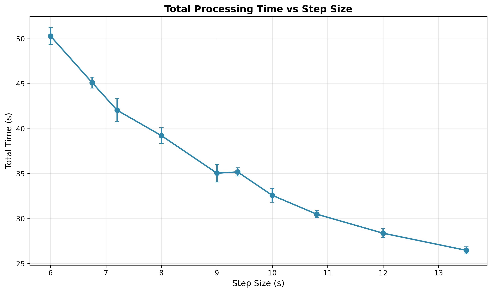
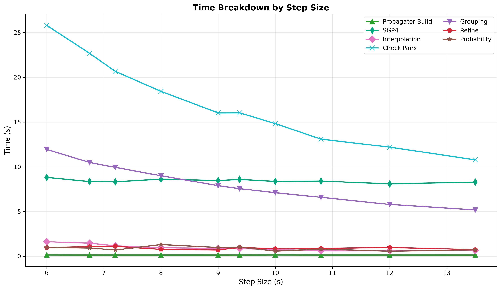
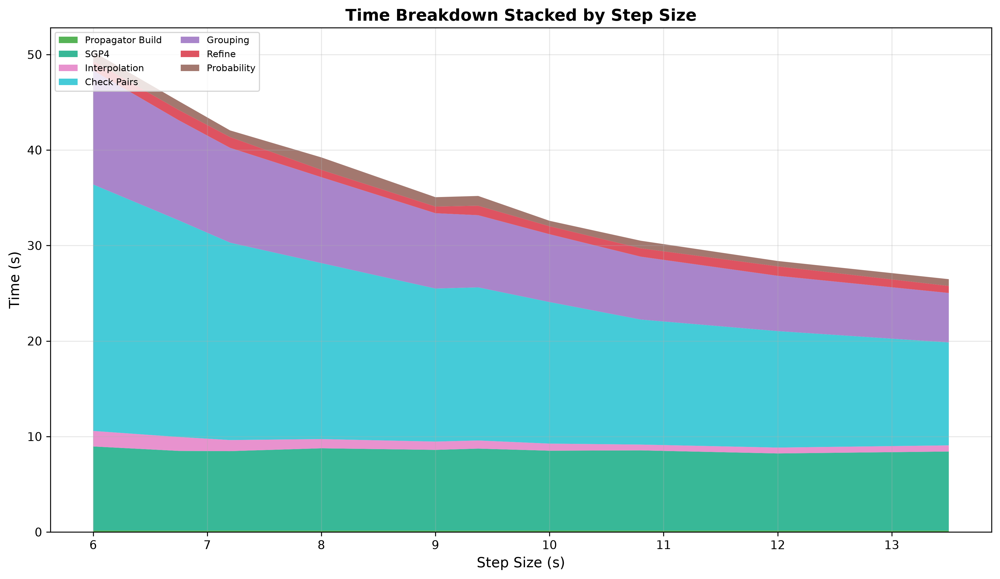
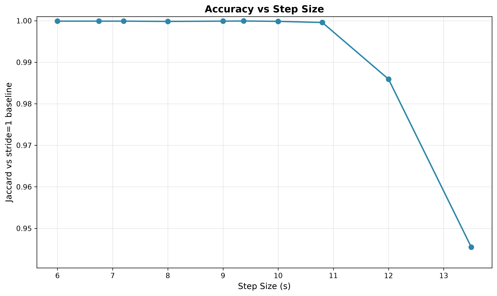

# Step Size Sweep

`step-seconds` is the interval between successive position samples in the coarse scan. Smaller steps mean more positions
to compute and scan, but less chance of skipping a close approach between samples.

## Parameters

- **tolerance-km**: 84, **cell-size-km**: 70
- **knot gap**: 200 s
- **threshold-km**: 5.0, **lookahead**: 24 h
- **iterations**: 5 per configuration
- **catalog**: 31,665 objects (element sets at most 10 days old, median age 8.7 h), one 24 h pass from 2026-08-03T18:00Z

## Results

| Step (s) | Stride | Conjunctions | Jaccard | Missed | v_guar    | Miss err p99 | Total Time |
|----------|--------|--------------|---------|--------|-----------|--------------|------------|
| 6.000    | 33     | 58,406       | 0.99990 | 3      | 23.3 km/s | 0.006 m      | 50.3s      |
| 6.750    | 30     | 58,406       | 0.99990 | 3      | 20.7 km/s | 0.007 m      | 45.1s      |
| 7.200    | 28     | 58,406       | 0.99990 | 3      | 19.4 km/s | 0.007 m      | 42.1s      |
| 8.000    | 25     | 58,406       | 0.99983 | 5      | 17.5 km/s | 0.007 m      | 39.2s      |
| 9.000    | 22     | 58,406       | 0.99990 | 3      | 15.5 km/s | 0.006 m      | 35.1s      |
| 9.375    | 21     | 58,406       | 0.99993 | 2      | 14.9 km/s | 0.006 m      | 35.2s      |
| 10.000   | 20     | 58,403       | 0.99985 | 6      | 14.0 km/s | 0.007 m      | 32.6s      |
| 10.800   | 19     | 58,387       | 0.99957 | 22     | 12.9 km/s | 0.008 m      | 30.5s      |
| 12.000   | 17     | 57,590       | 0.98593 | 819    | 11.6 km/s | 0.008 m      | 28.4s      |
| 13.500   | 15     | 55,225       | 0.94547 | 3183   | 10.3 km/s | 0.007 m      | 26.5s      |

From 6 s to 10 s the miss count stays between 2 and 6 out of 58,406, which is effectively noise, while cost drops from
50.3 s to 32.6 s. Accuracy starts falling rapidly past 10.8 s.

A conjunction is only guaranteed to be sampled inside the capture radius when
`min(cell_size, tolerance)^2 >= threshold^2 + (v_rel * step / 2)^2`. At closest approach the relative velocity is
perpendicular to the miss vector, so the miss and the distance covered in half a step are the legs of a right triangle.
Solving for the relative velocity:
`v_guar = 2 * sqrt(min(cell_size, tolerance)^2 - threshold^2) / step`

Miss distance error is flat across the whole sweep at 0.006 to 0.008 m. Step size either captures an event or does not.
It doesn't degrade captured ones.

