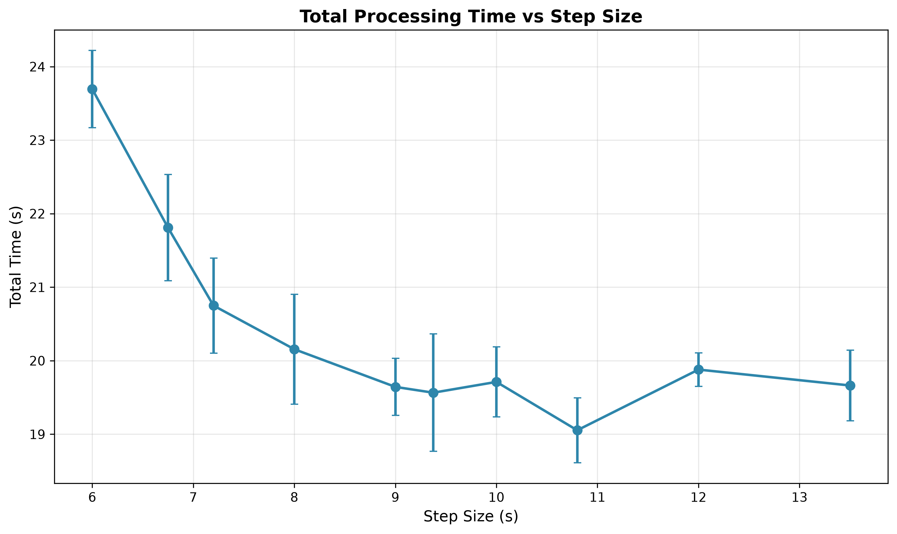
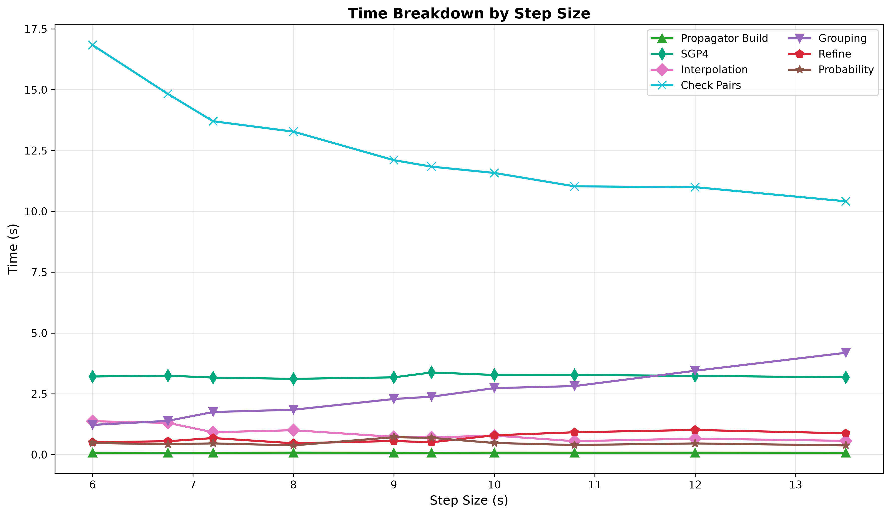
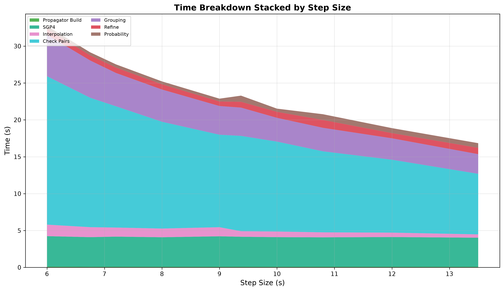
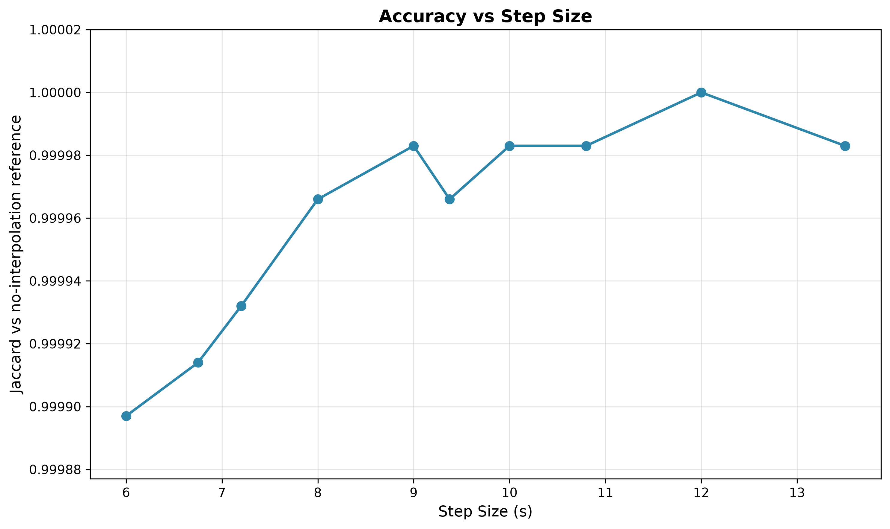

# Step Size Sweep

`step-seconds` is the interval between successive position samples in the coarse scan. Smaller steps mean more positions
to compute and scan, but less chance of skipping a close approach between samples.

## Parameters

- **tolerance**: derived from the step, `sqrt(5^2 + (15.6 * step / 2)^2)` km (see `docs/4`)
- **cell**: as wide as the tolerance
- **knot gap**: 252 s
- **threshold-km**: 5.0, **lookahead**: 24 h
- **iterations**: 5 per configuration
- **catalog**: 31,665 objects (element sets at most 10 days old, median age 8.7 h), one 24 h pass from 2026-08-03T18:00Z

## Results

| Step (s)   | Tolerance   | Knot Gap    | Conjunctions | Jaccard     | Missed | Extra | Miss err p99 | Total Time |
|------------|-------------|-------------|--------------|-------------|--------|-------|--------------|------------|
| 6.000      | 47.1 km     | 252.0 s     | 58,408       | 0.99990     | 2      | 4     | 0.037 m      | 23.7s      |
| 6.750      | 52.9 km     | 249.8 s     | 58,409       | 0.99991     | 1      | 4     | 0.038 m      | 21.8s      |
| 7.200      | 56.4 km     | 252.0 s     | 58,410       | 0.99993     | 0      | 4     | 0.038 m      | 20.7s      |
| 8.000      | 62.6 km     | 256.0 s     | 58,406       | 0.99997     | 1      | 1     | 0.044 m      | 20.2s      |
| 9.000      | 70.4 km     | 252.0 s     | 58,407       | 0.99998     | 0      | 1     | 0.038 m      | 19.6s      |
| 9.375      | 73.3 km     | 253.1 s     | 58,406       | 0.99997     | 1      | 1     | 0.042 m      | 19.6s      |
| 10.000     | 78.2 km     | 250.0 s     | 58,407       | 0.99998     | 0      | 1     | 0.037 m      | 19.7s      |
| 10.800     | 84.4 km     | 248.4 s     | 58,405       | 0.99998     | 1      | 0     | 0.037 m      | 19.1s      |
| **12.000** | **93.7 km** | **252.0 s** | **58,406**   | **1.00000** | **0**  | **0** | **0.038 m**  | **19.9s**  |
| 13.500     | 105.4 km    | 256.5 s     | 58,405       | 0.99998     | 1      | 0     | 0.044 m      | 19.7s      |

Bold row is the production step.

The tolerance and the cell both follow the step (`docs/4`), so every step captures every pair closing under 15.6 km/s
and the step is not an accuracy setting. Every step from 6 to
13.5 s stays within 6 mismatched events of the reference. Time falls from 23.7 s at 6 s and then stays between 19.1 and
19.9 s from 9 s up: a longer step scans fewer steps, so the coarse scan drops from 16.8 to 10.4 s, but each step admits
more detections through its wider tolerance, so grouping grows from 1.2 to 4.2 s.

Every mismatch was traced event by event against a fine SGP4 search for the true closest approach.

Every missed event is a pair closing faster than the 15.6 km/s the tolerance is sized for (15.9 to 17.1 km/s), which
was 0.04 to 2.1 km outside the tolerance at its nearest sampled step. The tolerance trades these few for its size
(`docs/4`).

Every extra event is real. Four pairs drifting at 4 to 90 m/s each have two minima under 5 km, 47 min to 12 h apart.
Between them the pair drifts 58 to 83 km apart, so a step whose tolerance is narrower than that sees the pair leave
range and reports two events, while the reference's 84 km keeps it in range and reports one. Three pairs drift under
62.6 km and split only up to 7.2 s, the fourth drifts 83.4 km and splits up to 10 s. From 10.8 s the tolerance spans
all four.

Miss distance error is flat across the whole sweep at 0.037 to 0.044 m. Step size either captures an event or does not.
It doesn't degrade captured ones.

