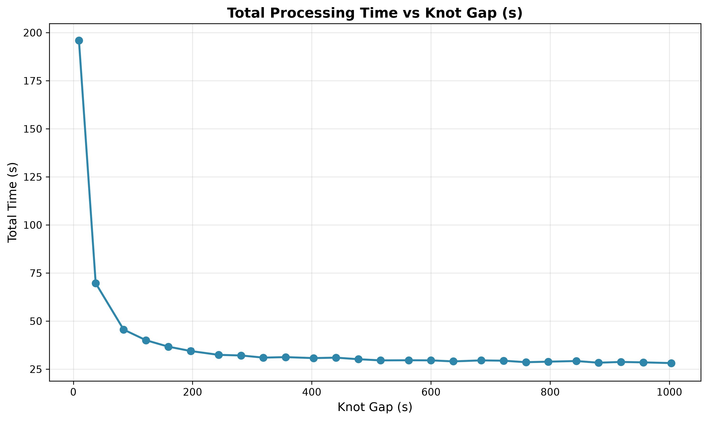
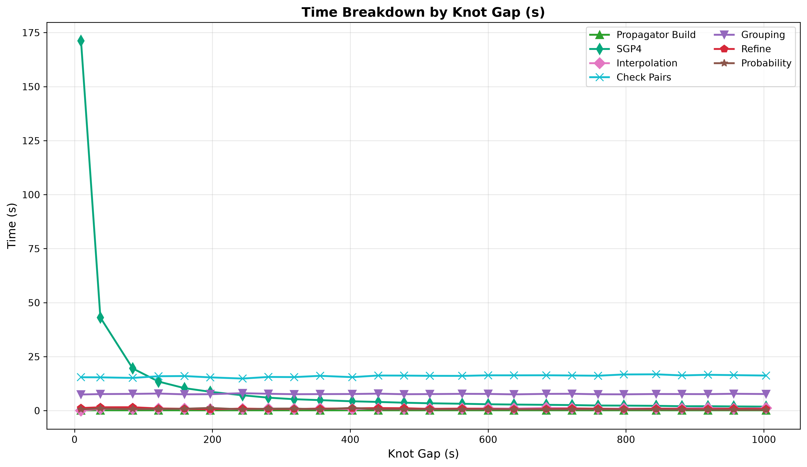
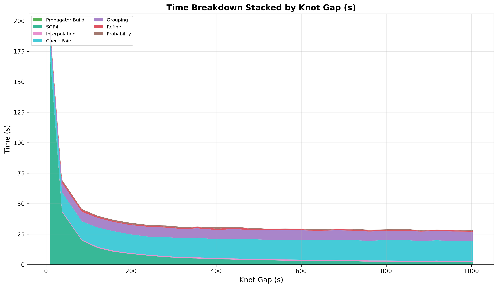
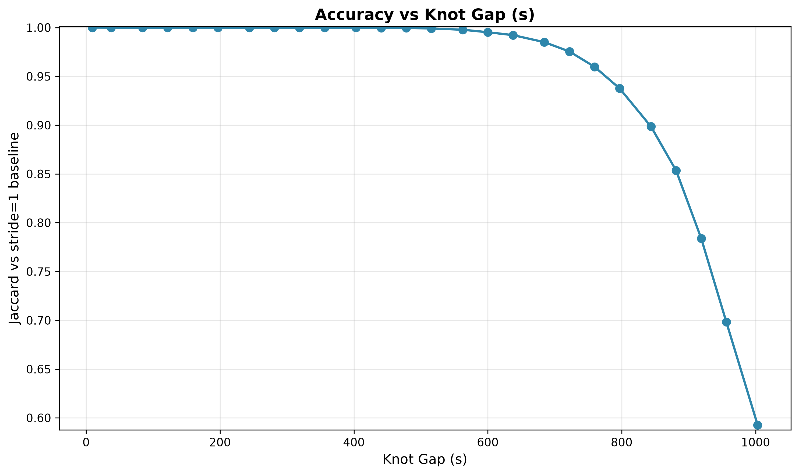
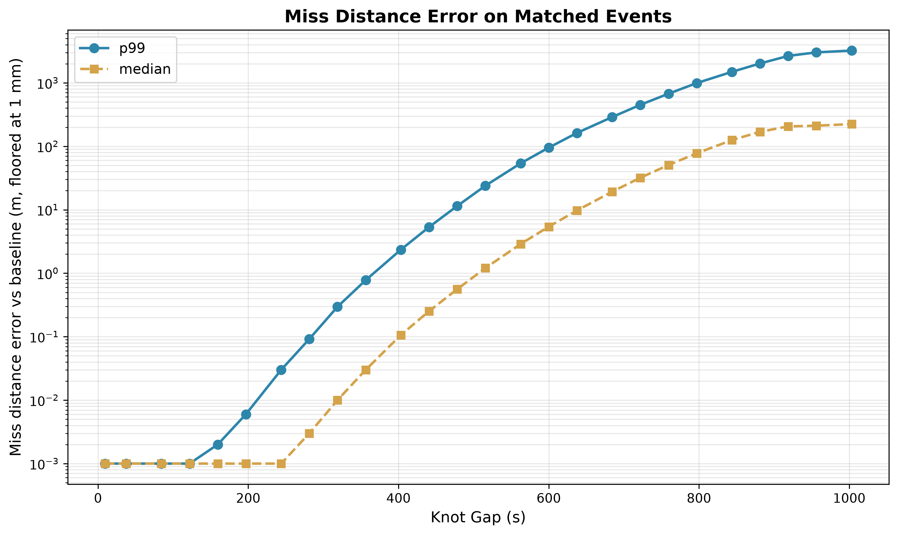

# Knot Gap Sweep

SGP4 runs only at knot points; Hermite cubic interpolation fills in every step between them, using position and velocity
at both ends. The **knot gap** is the spacing between those SGP4 calls in seconds, and
`interpolation-stride = knot_gap / step_seconds` is the derived config value.

## Parameters

- **tolerance-km**: 84, **step-seconds**: 9.375, **cell-size-km**: 70
- **threshold-km**: 5.0, **lookahead**: 24 h
- **iterations**: 5 per configuration
- **catalog**: 31,665 objects (element sets at most 10 days old, median age 8.7 h), one 24 h pass from 2026-08-03T18:00Z

## Results

| Knot Gap | Stride | Conjunctions | Jaccard | Missed | Miss err p99 | Total Time |
|----------|--------|--------------|---------|--------|--------------|------------|
| 9.4 s    | 1      | 58,406       | 1.00000 | 0      | 0.000 m      | 196.0s     |
| 37.5 s   | 4      | 58,406       | 0.99993 | 2      | 0.000 m      | 69.7s      |
| 84.4 s   | 9      | 58,406       | 0.99983 | 5      | 0.000 m      | 45.6s      |
| 121.9 s  | 13     | 58,406       | 0.99986 | 4      | 0.001 m      | 40.0s      |
| 159.4 s  | 17     | 58,406       | 0.99986 | 4      | 0.002 m      | 36.7s      |
| 196.9 s  | 21     | 58,406       | 0.99993 | 2      | 0.006 m      | 34.4s      |
| 243.8 s  | 26     | 58,406       | 0.99990 | 3      | 0.030 m      | 32.4s      |
| 281.3 s  | 30     | 58,406       | 0.99990 | 3      | 0.092 m      | 32.1s      |
| 318.8 s  | 34     | 58,406       | 0.99993 | 2      | 0.296 m      | 31.0s      |
| 356.3 s  | 38     | 58,405       | 0.99985 | 5      | 0.777 m      | 31.2s      |
| 403.1 s  | 43     | 58,402       | 0.99983 | 7      | 2.348 m      | 30.7s      |
| 440.6 s  | 47     | 58,389       | 0.99964 | 19     | 5.331 m      | 31.0s      |
| 478.1 s  | 51     | 58,384       | 0.99955 | 24     | 11.448 m     | 30.2s      |
| 515.6 s  | 55     | 58,358       | 0.99908 | 51     | 23.919 m     | 29.5s      |
| 562.5 s  | 60     | 58,281       | 0.99776 | 128    | 53.864 m     | 29.6s      |
| 600.0 s  | 64     | 58,131       | 0.99522 | 277    | 95.295 m     | 29.6s      |
| 637.5 s  | 68     | 57,960       | 0.99226 | 449    | 162.340 m    | 29.0s      |
| 684.4 s  | 73     | 57,537       | 0.98505 | 871    | 288.762 m    | 29.5s      |
| 721.9 s  | 77     | 56,981       | 0.97547 | 1429   | 450.674 m    | 29.4s      |
| 759.4 s  | 81     | 56,070       | 0.95980 | 2342   | 674.091 m    | 28.6s      |
| 796.9 s  | 85     | 54,777       | 0.93763 | 3636   | 991.279 m    | 28.9s      |
| 843.8 s  | 90     | 52,487       | 0.89850 | 5924   | 1490.119 m   | 29.2s      |
| 881.3 s  | 94     | 49,855       | 0.85343 | 8556   | 2019.695 m   | 28.3s      |
| 918.8 s  | 98     | 45,788       | 0.78390 | 12620  | 2656.746 m   | 28.7s      |
| 956.3 s  | 102    | 40,790       | 0.69824 | 17621  | 3022.516 m   | 28.5s      |
| 1003.1 s | 107    | 34,625       | 0.59264 | 23788  | 3222.684 m   | 28.1s      |

Time saturates near 29 s while accuracy keeps falling. Everything past roughly 400 s buys under 3 s and costs missed
events at an accelerating rate.

This is the only parameter that degrades events instead of just losing them. Miss distance error grows from 0 at short
gaps to 3.2 km at 1000 s, because `refine` fits its analytical minimum to interpolated positions.

When the interpolation is completely wrong the analytical minimum lands outside the 6.5 km gate and the event is
discarded before SGP4 is ever called.

The median plateau near 220 m in `5_miss_error.png` is an artifact of the metric, not a bound on the error. Miss error
covers matched events only, and an event matches only if both runs put it within 5 km, so no matched event can differ by
more than that. The worst-interpolated events are the ones pushed past the threshold and dropped, so the statistic
saturates.

