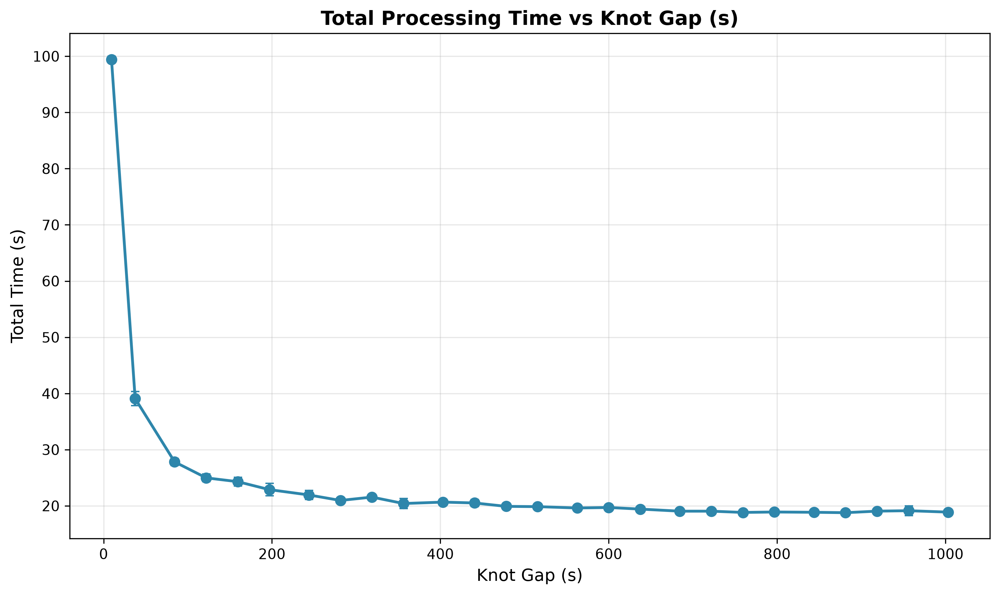
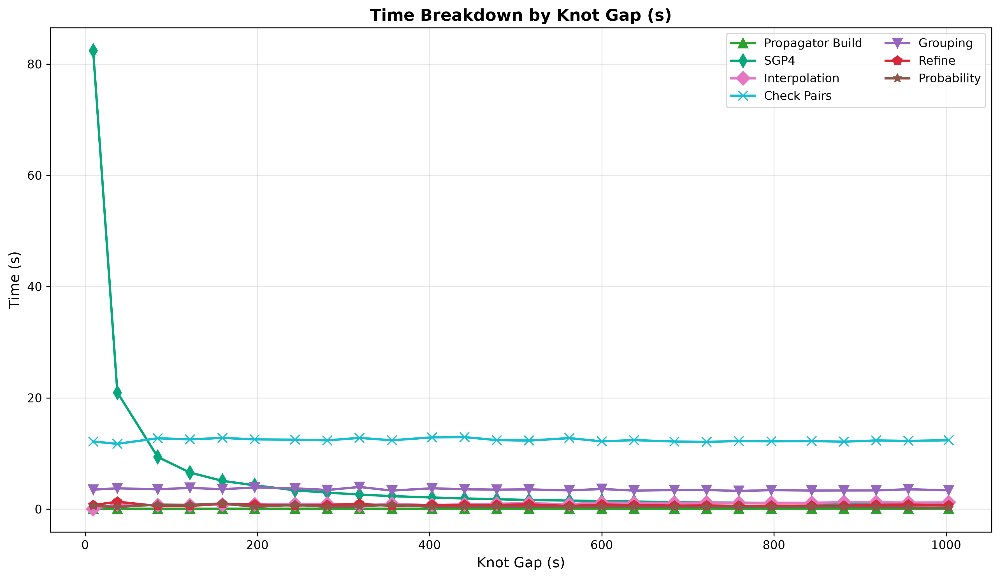
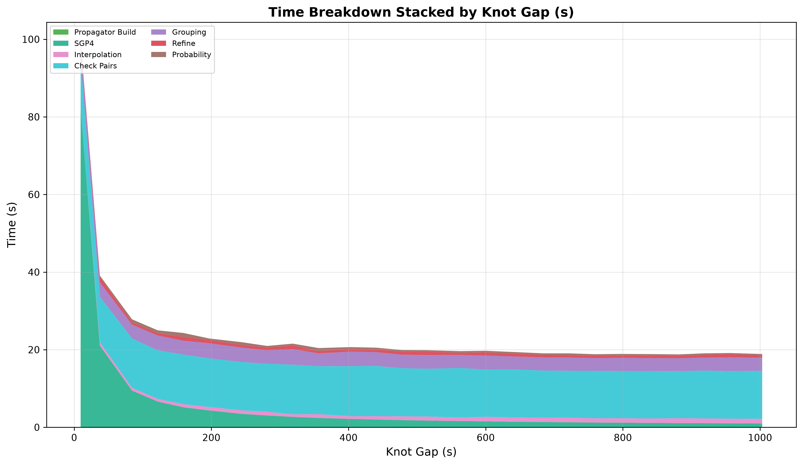
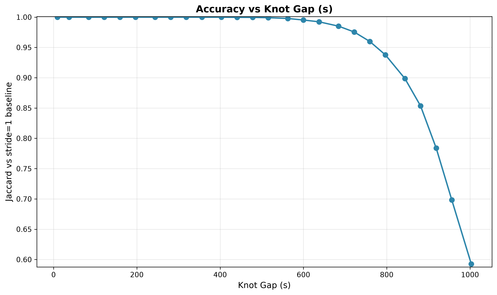
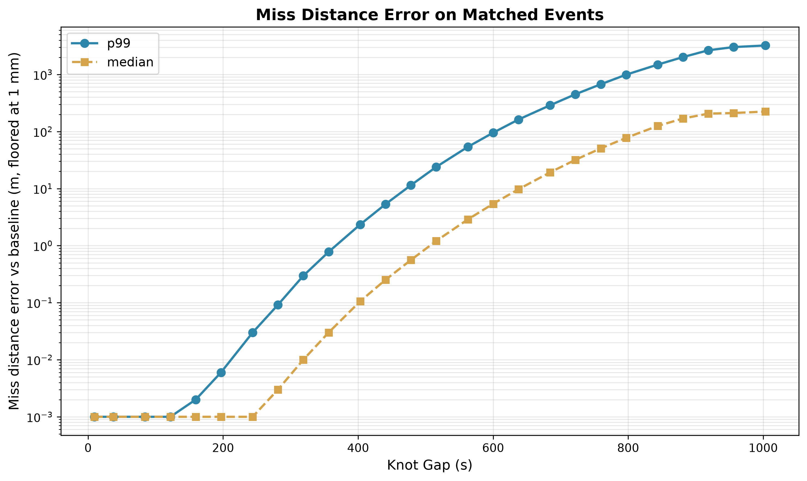

# Knot Gap Sweep

SGP4 runs only at knot points; Hermite cubic interpolation fills in every step between them, using position and velocity
at both ends. The **knot gap** is the spacing between those SGP4 calls in seconds, rounded to a whole number of steps.

## Parameters

- **step-seconds**: 12, tolerance derived from it (93.7 km), **cell**: as wide as the tolerance
- **threshold-km**: 5.0, **lookahead**: 24 h
- **iterations**: 5 per configuration
- **catalog**: 31,665 objects (element sets at most 10 days old, median age 8.7 h), one 24 h pass from 2026-08-03T18:00Z

## Results

| Knot Gap (s) | Conjunctions | Jaccard | Missed | Extra | Miss err p99 | Total Time |
|--------------|--------------|---------|--------|-------|--------------|------------|
| 12.0         | 58,406       | 1.00000 | 0      | 0     | 0.000 m      | 77.7s      |
| 36.0         | 58,406       | 1.00000 | 0      | 0     | 0.000 m      | 37.6s      |
| 84.0         | 58,406       | 1.00000 | 0      | 0     | 0.000 m      | 25.1s      |
| 120.0        | 58,406       | 1.00000 | 0      | 0     | 0.001 m      | 22.6s      |
| 156.0        | 58,406       | 1.00000 | 0      | 0     | 0.002 m      | 21.1s      |
| 204.0        | 58,406       | 1.00000 | 0      | 0     | 0.008 m      | 19.8s      |
| 240.0        | 58,406       | 1.00000 | 0      | 0     | 0.026 m      | 19.8s      |
| 276.0        | 58,406       | 1.00000 | 0      | 0     | 0.081 m      | 19.1s      |
| 324.0        | 58,405       | 0.99998 | 1      | 0     | 0.309 m      | 18.5s      |
| 360.0        | 58,405       | 0.99998 | 1      | 0     | 0.819 m      | 18.2s      |
| 396.0        | 58,402       | 0.99993 | 4      | 0     | 1.967 m      | 17.9s      |
| 444.0        | 58,391       | 0.99974 | 15     | 0     | 5.846 m      | 18.1s      |
| 480.0        | 58,374       | 0.99945 | 32     | 0     | 12.330 m     | 17.9s      |
| 516.0        | 58,355       | 0.99913 | 51     | 0     | 23.700 m     | 17.8s      |
| 564.0        | 58,272       | 0.99771 | 134    | 0     | 51.830 m     | 17.6s      |
| 600.0        | 58,131       | 0.99529 | 275    | 0     | 95.326 m     | 17.6s      |
| 636.0        | 57,969       | 0.99252 | 437    | 0     | 151.170 m    | 17.6s      |
| 684.0        | 57,531       | 0.98502 | 875    | 0     | 288.628 m    | 17.5s      |
| 720.0        | 57,009       | 0.97608 | 1397   | 0     | 446.163 m    | 17.6s      |
| 756.0        | 56,130       | 0.96100 | 2277   | 1     | 650.365 m    | 17.6s      |
| 804.0        | 54,522       | 0.93350 | 3884   | 0     | 1048.002 m   | 17.2s      |
| 840.0        | 52,718       | 0.90258 | 5689   | 1     | 1454.003 m   | 17.4s      |
| 876.0        | 50,270       | 0.86070 | 8136   | 0     | 1924.737 m   | 17.2s      |
| 924.0        | 45,221       | 0.77425 | 13185  | 0     | 2763.377 m   | 17.4s      |
| 960.0        | 40,080       | 0.68623 | 18326  | 0     | 3048.609 m   | 16.8s      |
| 996.0        | 35,764       | 0.61233 | 22642  | 0     | 3161.809 m   | 17.1s      |

The production gap, 252 s (21 steps), sits between the 240 s and 276 s rows.

Nothing is lost up to 276 s, one event at 324 and 360 s, then losses accelerate: 4 at 396 s, 32 at 480 s, 275 at
600 s. Time falls steeply at first, 78 s with an SGP4 call at every step to under 20 s by 204 s, then stays between 16.8
and 18.5 s from
324 s on. Past roughly 400 s the gap buys about a second and costs missed events at an accelerating rate.

This is the only parameter that degrades events instead of just losing them. Miss distance error grows from 0 at short
gaps to 3.2 km (p99) at 996 s, because `refine` estimates the TCA from interpolated positions, and SGP4 evaluated at a
slightly wrong TCA reads a larger separation.

The same error is what loses events: SGP4 at the misestimated TCA lands just above 5 km.

The median plateau near 200 to 220 m in `5_miss_error.png` is an artifact of the metric, not a bound on the error.
Miss error covers matched events only, and an event matches only if both runs put it within 5 km, so no matched event
can differ by more than that. The worst-interpolated events are the ones pushed past the threshold and dropped, so the
statistic
saturates.

