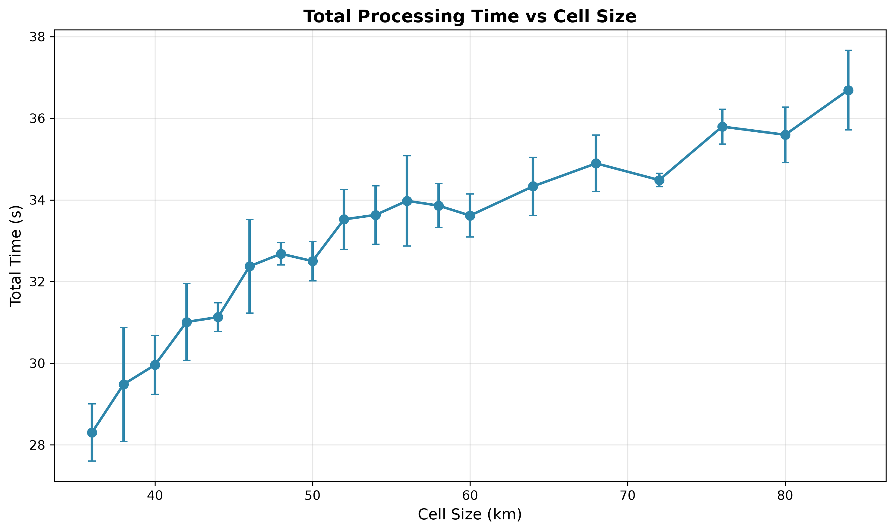
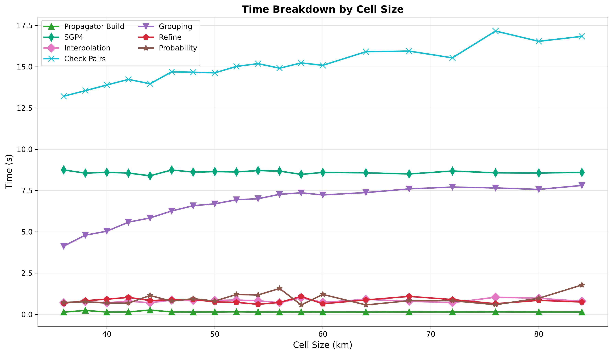
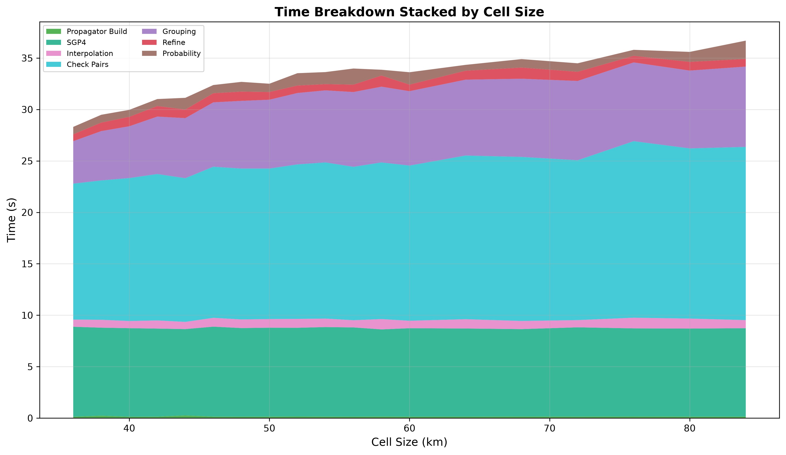
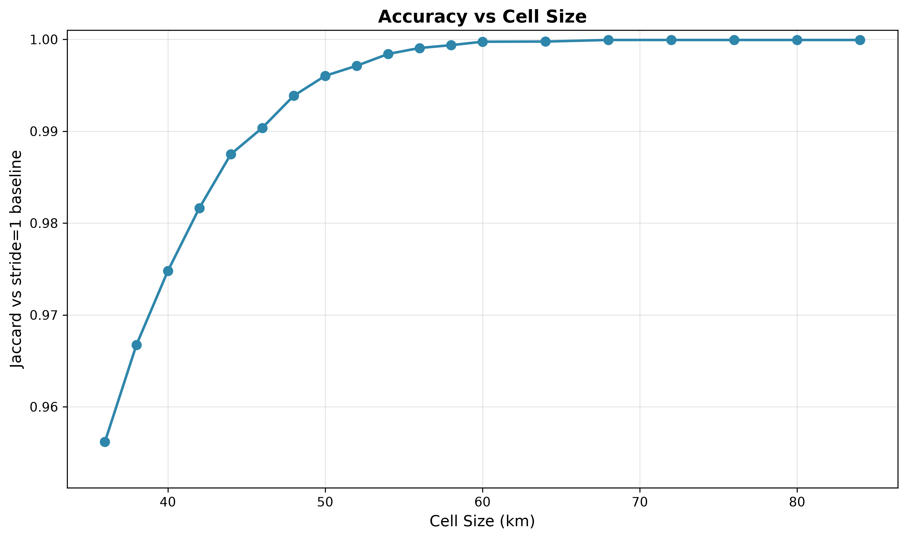

# Cell Size Sweep

`cell-size-km` is the edge of the cube cells the spatial grid buckets positions into. The grid compares each cell
against itself and 13 half-neighbors, so a pair separated by more than one cell along any axis is never tested. Larger
cells test more pairs per step and catch more, but smaller cells are cheaper.

## Parameters

- **tolerance-km**: 84, **step-seconds**: 9.375
- **knot gap**: 197 s
- **threshold-km**: 5.0, **lookahead**: 24 h
- **iterations**: 5 per configuration
- **catalog**: 31,665 objects (element sets at most 10 days old, median age 8.7 h), one 24 h pass from 2026-08-03T18:00Z

## Results

| Cell (km) | Conjunctions | Jaccard | Missed | v_guar    | Total Time |
|-----------|--------------|---------|--------|-----------|------------|
| 84        | 58,406       | 0.99993 | 2      | 16.8 km/s | 36.7s      |
| 80        | 58,406       | 0.99993 | 2      | 16.0 km/s | 35.6s      |
| 76        | 58,406       | 0.99993 | 2      | 15.2 km/s | 35.8s      |
| 72        | 58,406       | 0.99993 | 2      | 14.3 km/s | 34.5s      |
| 68        | 58,406       | 0.99993 | 2      | 13.4 km/s | 34.9s      |
| 64        | 58,396       | 0.99976 | 12     | 12.6 km/s | 34.3s      |
| 60        | 58,397       | 0.99974 | 12     | 11.7 km/s | 33.6s      |
| 58        | 58,375       | 0.99937 | 34     | 11.3 km/s | 33.9s      |
| 56        | 58,357       | 0.99906 | 52     | 10.9 km/s | 34.0s      |
| 54        | 58,319       | 0.99841 | 90     | 10.5 km/s | 33.6s      |
| 52        | 58,244       | 0.99712 | 165    | 10.0 km/s | 33.5s      |
| 50        | 58,180       | 0.99603 | 229    | 9.6 km/s  | 32.5s      |
| 48        | 58,053       | 0.99385 | 356    | 9.2 km/s  | 32.7s      |
| 46        | 57,849       | 0.99036 | 560    | 8.8 km/s  | 32.4s      |
| 44        | 57,683       | 0.98748 | 727    | 8.3 km/s  | 31.1s      |
| 42        | 57,341       | 0.98163 | 1069   | 7.9 km/s  | 31.0s      |
| 40        | 56,941       | 0.97478 | 1469   | 7.5 km/s  | 30.0s      |
| 38        | 56,472       | 0.96672 | 1939   | 7.0 km/s  | 29.5s      |
| 36        | 55,856       | 0.95617 | 2555   | 6.6 km/s  | 28.3s      |

Accuracy is steady at 68 km and above. Going lower loses more and more events.

Losses follow the guarantee `v_guar = 2 * (cell_size - threshold) / step` derived in `docs/1`. They stay in the noise
while the guarantee is above roughly 12 km/s and climb steeply once it drops below, the same threshold the step size
sweep shows.

Capture is bounded by `min(cell_size, tolerance)`, and tolerance is 84 km here, so cells at or above 84 km cannot raise
the guarantee no matter how wide they get. Widening past the tolerance is pointless.

Miss distance error is 0.006 m at every cell size. Cell size determines if events get detected, it doesn't corrupt them.

