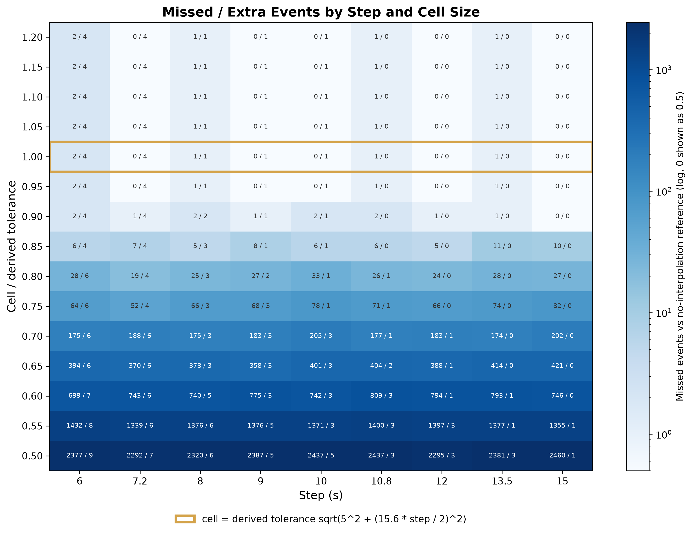
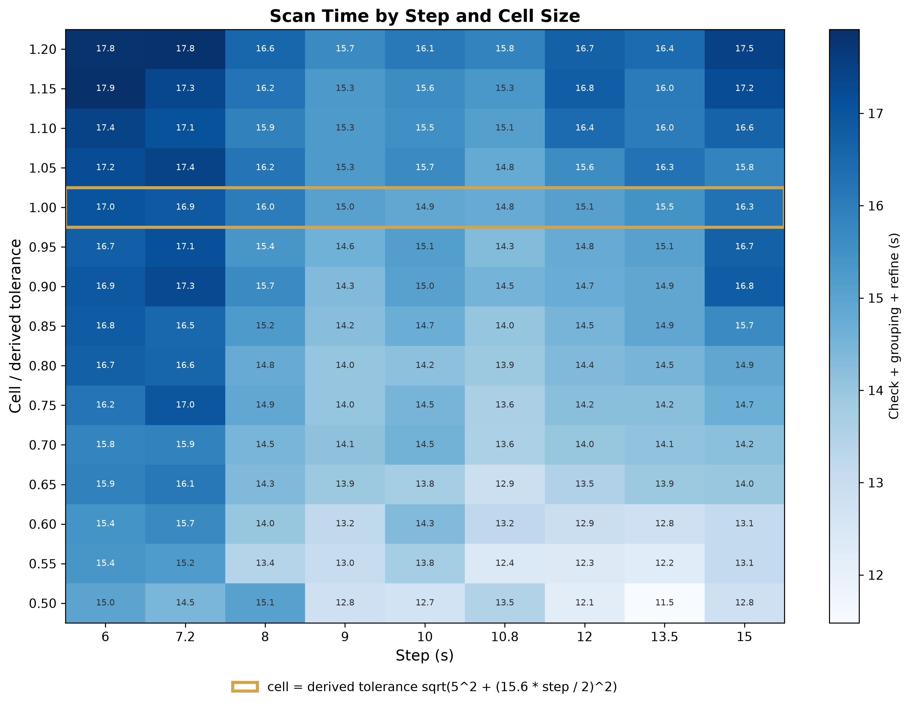

# Cell Size

The spatial grid buckets positions into cube cells and compares each cell against itself and 13 half-neighbors, so a
pair separated by more than one cell along any axis is never tested. Production makes the cell as wide as the tolerance:
a pair inside the tolerance is then at most one cell apart on every axis, so the grid never drops a pair the tolerance
keeps. The cell is not a configuration value. This sweep moves it to either side of the tolerance, as a fraction of it,
at every step, to see what narrowing it would lose and what widening it would cost.

## Parameters

- **steps**: 6, 7.2, 8, 9, 10, 10.8, 12, 13.5, 15 s, tolerance derived from each (`docs/4`)
- **cell / tolerance**: 0.5 to 1.2 in 0.05 steps
- **knot gap**: 252 s, **threshold-km**: 5.0, **lookahead**: 24 h
- **iterations**: 1 per configuration (accuracy is deterministic), propagation shared by every cell at a step
- **catalog**: 31,665 objects (element sets at most 10 days old, median age 8.7 h), one 24 h pass from 2026-08-03T18:00Z

## Results

The 1.00 row reproduces the step sweep (`docs/1`) exactly at the eight steps both share: its few mismatches come from the
tolerance, not the grid. Grid loss is what a narrower cell misses beyond that row.

| Cell / tolerance | Grid loss, min to max over the 9 steps |
|------------------|----------------------------------------|
| 0.95             | 0 to 0                                 |
| 0.90             | 0 to 2                                 |
| 0.85             | 4 to 10                                |
| 0.80             | 19 to 33                               |
| 0.75             | 52 to 82                               |
| 0.70             | 173 to 205                             |
| 0.65             | 358 to 421                             |
| 0.60             | 697 to 808                             |
| 0.55             | 1339 to 1430                           |
| 0.50             | 2292 to 2460                           |

Grid loss depends on the fraction and not on the cell in km: at each fraction it is about the same at every step,
though the cell spans 47 to 117 km at 1.00. 0.95 loses nothing at any step, 0.90 at most 2, and the loss climbs steeply
below. The grid's own guarantee, `v_guar = 2 * sqrt(cell^2 - threshold^2) / step`, is the tolerance's form (`docs/4`)
with the cell in its place, close to the fraction times 15.6 km/s at every step: 14.8 km/s at 0.95, 14.0 km/s at 0.90.
0.95 is lossless on this catalog only; 1.00 is lossless on any.

A narrower cell also adds up to 5 extra events, more at shorter steps; from 0.95 up the extras equal the 1.00 row. Every
one traced (6 and 8 s, at 0.5, 0.8 and 0.9) is a slow pair, 4 to 65 m/s, that stays inside the tolerance between two
real closest approaches 47 min to 12 h apart. At 1.00 that is one unbroken run of detections, reported once at its
closest. A narrower cell skips the steps where the pair sits more than one cell apart on some axis, the run breaks, and
the other approach is reported too. Each is a true minimum of the separation under 5 km, and nothing is missed in
exchange.

Widening the cell from 1.00 to 1.20 records the same detections at every step and adds 0.6 to 1.6 s of scan time (check,
grouping and refinement): larger cells hand the distance check more pairs that the tolerance then rejects. Narrowing it
to 0.90 saves at most 0.7 s, and at three steps it is slower; 0.50 saves 1.0 to 4.0 s for 2,292 to 2,460 lost events.

Miss distance error is 0.035 to 0.044 m (p99) everywhere. The cell changes which pairs are compared, not the precision
of the ones that survive.
