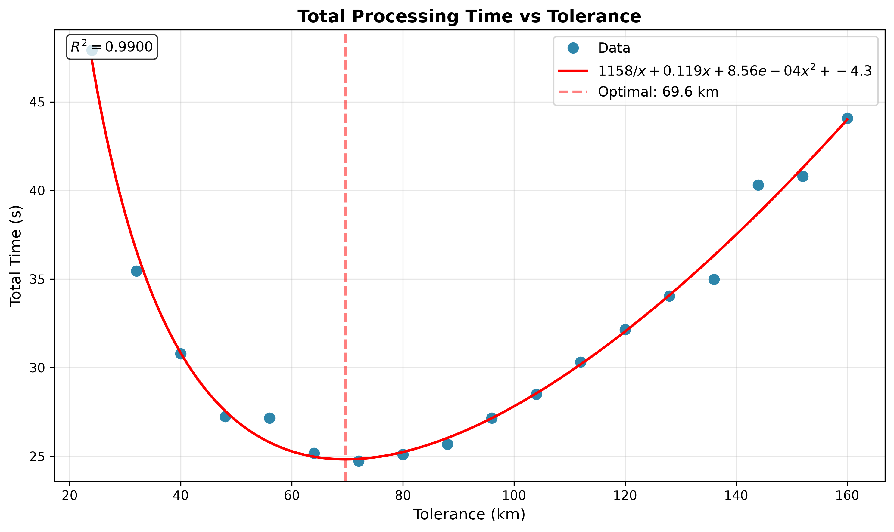
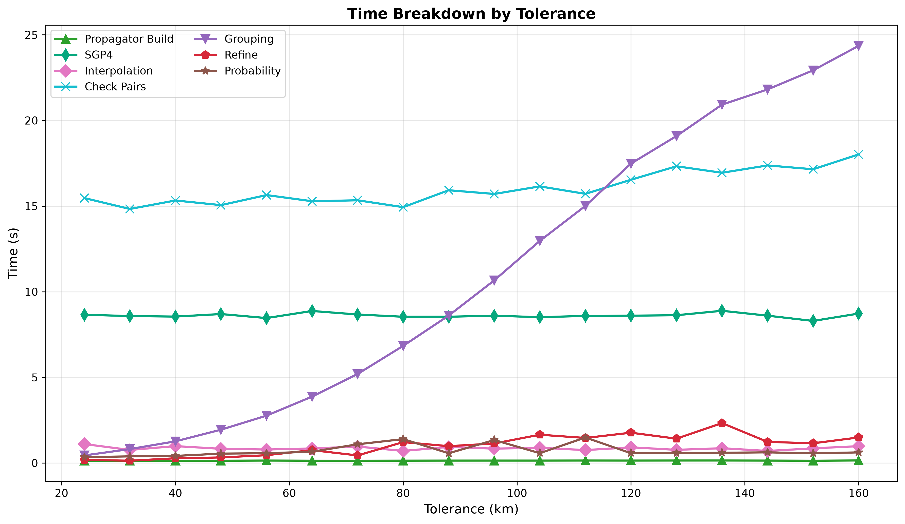
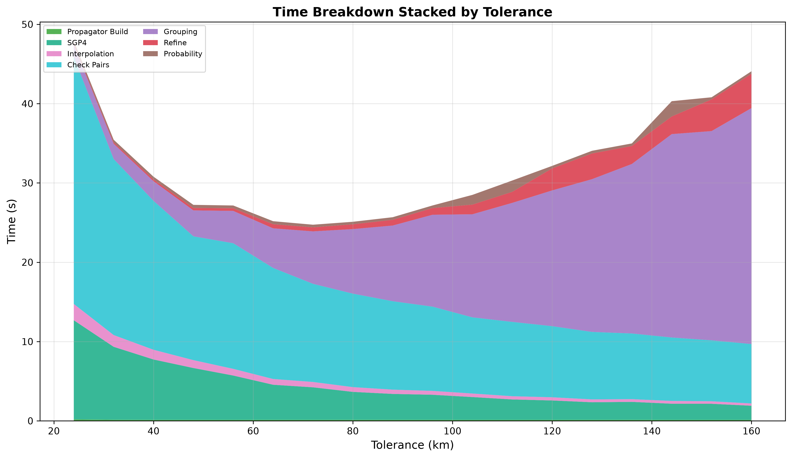
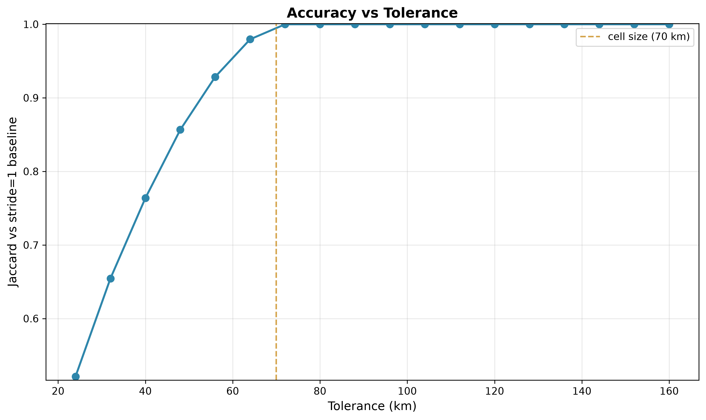

# Conjunction Tolerance Sweep

`tolerance-km` is the coarse scan radius. Any pair flagged by the spatial grid that's closer than this at a sampled
instant becomes a candidate for refinement.

## Parameters

- **step-seconds**: 9.375, **cell-size-km**: 70
- **knot gap**: 197 s
- **threshold-km**: 5.0, **lookahead**: 24 h
- **iterations**: 5 per configuration
- **catalog**: 31,665 objects (element sets at most 10 days old, median age 8.7 h), one 24 h pass from 2026-08-03T18:00Z

## Results

| Tolerance (km) | Conjunctions | Jaccard | Missed | Miss err p99 | Total Time |
|----------------|--------------|---------|--------|--------------|------------|
| 24             | 30,466       | 0.52129 | 27953  | 0.006 m      | 26.3s      |
| 32             | 38,244       | 0.65454 | 20171  | 0.005 m      | 25.6s      |
| 40             | 44,617       | 0.76367 | 13797  | 0.005 m      | 26.9s      |
| 48             | 50,042       | 0.85660 | 8370   | 0.006 m      | 27.5s      |
| 56             | 54,243       | 0.92853 | 4169   | 0.006 m      | 28.8s      |
| 64             | 57,217       | 0.97954 | 1192   | 0.006 m      | 30.4s      |
| 72             | 58,406       | 0.99990 | 3      | 0.006 m      | 31.8s      |
| 80             | 58,407       | 0.99991 | 2      | 0.006 m      | 33.8s      |
| 88             | 58,406       | 0.99993 | 2      | 0.006 m      | 35.7s      |
| 96             | 58,406       | 0.99993 | 2      | 0.006 m      | 38.4s      |
| 104            | 58,406       | 0.99993 | 2      | 0.006 m      | 40.9s      |
| 112            | 58,406       | 0.99993 | 2      | 0.006 m      | 43.2s      |
| 120            | 58,406       | 0.99993 | 2      | 0.006 m      | 46.0s      |
| 128            | 58,406       | 0.99993 | 2      | 0.006 m      | 48.0s      |
| 136            | 58,406       | 0.99993 | 2      | 0.006 m      | 50.7s      |
| 144            | 58,406       | 0.99993 | 2      | 0.006 m      | 50.5s      |
| 152            | 58,406       | 0.99993 | 2      | 0.006 m      | 51.1s      |
| 160            | 58,406       | 0.99993 | 2      | 0.006 m      | 54.3s      |

Tolerance has no practical optimum. Accuracy climbs steeply to 72 km, then stays flat after that, while cost rises
monotonically. There's no benefit past that point.

The knee sits at the locked cell size. Capture is bounded by `min(cell_size, tolerance)`, so above 70 km the cell size
binds and the scan cannot catch anything more, but the extra radius still admits more edge candidate pairs.

Tolerance should be a bit above the cell size and no further.

Miss distance error is 0.005 to 0.006 m everywhere. Tolerance changes which pairs are examined, not the precision of the
ones that survive.

