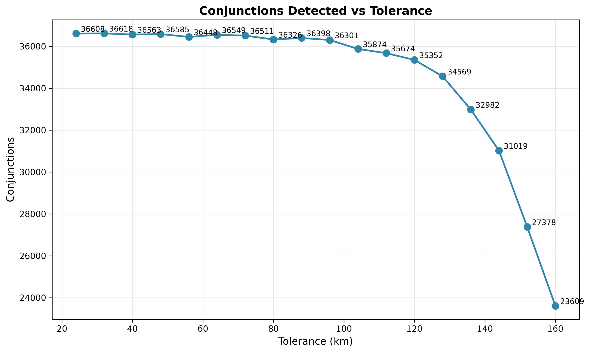

# Conjunction Tolerance Sweep

The tolerance parameter sets the coarse scan distance threshold AND determines the time step size via
`step_seconds = tolerance_km / step_ratio`. Larger tolerance means larger time steps (fewer SGP4 calls, cheaper
propagation) but more coarse detections to group. Smaller tolerance means finer time steps (more SGP4 calls) but fewer
detections. The optimum balances propagation cost against grouping cost.

## Parameters

- **step-ratio**: Fixed at 8
- **interpolation-stride**: Fixed at 50
- **cell-ratio**: Fixed at 1.65
- **lookahead-hours**: Fixed at 24
- **threshold-km**: Fixed at 5.0 km
- **tolerance-km**: Swept 24-160 km
- **iterations**: 1 per configuration

## Results

| Tolerance (km) | Conjunctions | Accuracy | Loss   | Total Time |
|----------------|--------------|----------|--------|------------|
| 24             | 36,608       | 99.97%   | 0.03%  | 47.9s      |
| 32             | 36,618       | 100.00%  | 0.00%  | 35.4s      |
| 40             | 36,563       | 99.85%   | 0.15%  | 30.8s      |
| 48             | 36,585       | 99.91%   | 0.09%  | 27.2s      |
| 56             | 36,448       | 99.54%   | 0.46%  | 27.2s      |
| 64             | 36,549       | 99.81%   | 0.19%  | 25.2s      |
| 72             | 36,511       | 99.71%   | 0.29%  | 24.7s      |
| 80             | 36,326       | 99.20%   | 0.80%  | 25.1s      |
| 88             | 36,398       | 99.40%   | 0.60%  | 25.7s      |
| 96             | 36,301       | 99.13%   | 0.87%  | 27.2s      |
| 104            | 35,874       | 97.97%   | 2.03%  | 28.5s      |
| 112            | 35,674       | 97.42%   | 2.58%  | 30.3s      |
| 120            | 35,352       | 96.54%   | 3.46%  | 32.1s      |
| 128            | 34,569       | 94.40%   | 5.60%  | 34.1s      |
| 136            | 32,982       | 90.07%   | 9.93%  | 35.0s      |
| 144            | 31,019       | 84.71%   | 15.29% | 40.3s      |
| 152            | 27,378       | 74.77%   | 25.23% | 40.8s      |
| 160            | 23,609       | 64.47%   | 35.53% | 44.1s      |

Fit gives optimal at **69.6 km ~= 72 km** - the coarse and refine stages of the pipeline are balanced. Conjunction count
is relatively stable, staying at >99% up to tolerance=100km.

