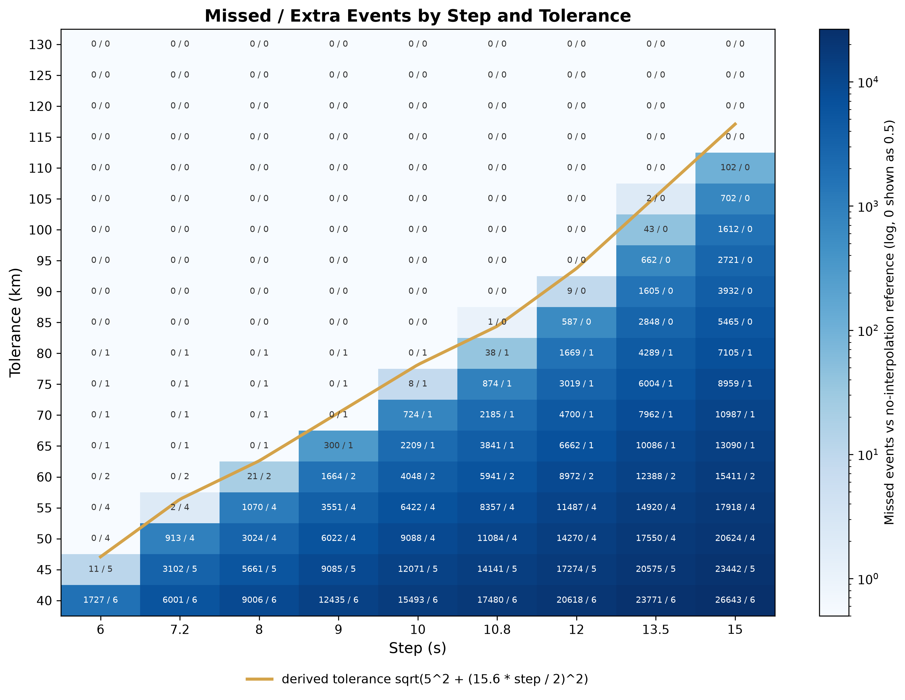
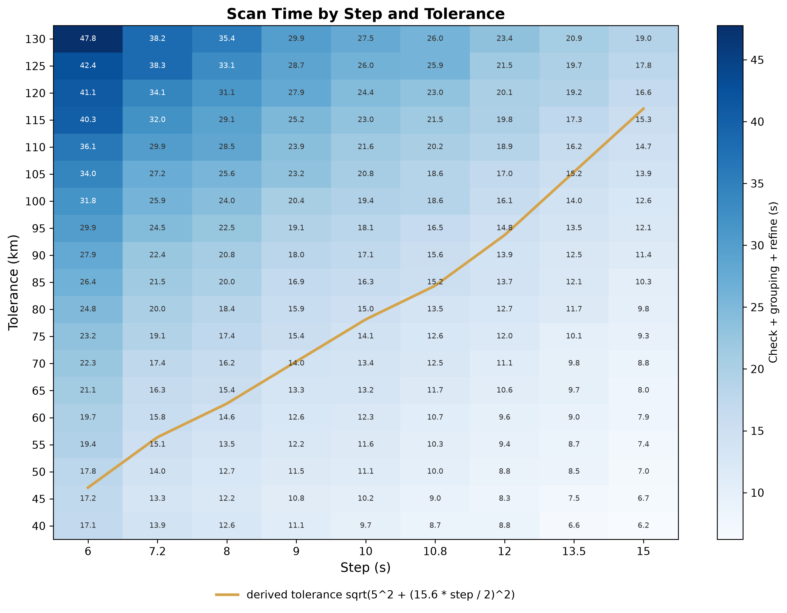

# Conjunction Tolerance

The tolerance is the coarse scan radius. A pair flagged by the spatial grid that is closer than this at a sampled step
becomes a candidate for refinement. A pair that is farther than this at every sampled step is never recorded, so the
tolerance is a hard bound on what the scan can find, and it is not a configuration value. `ScanService` derives it from
the step:

    tolerance = sqrt(threshold^2 + (15.6 * step / 2)^2)

The nearest sampled step lies at most half a step from a closest approach. At closest approach the miss vector is
perpendicular to the relative velocity, so the miss and the distance covered in half a step are the legs of a right
triangle. 15.6 km/s is the head-on closing speed of two circular low orbits, twice the 7.8 km/s orbital speed. Any pair
closing slower than that is inside the tolerance at its nearest step, whatever the step. With the cell equal to the
tolerance (`docs/3`), only the step and the knot gap are left to tune (`docs/5`).

## Parameters

- **steps**: 6, 7.2, 8, 9, 10, 10.8, 12, 13.5, 15 s; **tolerances**: 40 to 130 km in 5 km steps, swept explicitly
- **cell**: as wide as the swept tolerance, so the grid loses nothing at any point (`docs/3`)
- **knot gap**: 252 s, **threshold-km**: 5.0, **lookahead**: 24 h
- **iterations**: 1 per configuration (accuracy is deterministic), propagation shared by every tolerance at a step
- **catalog**: 31,665 objects (element sets at most 10 days old, median age 8.7 h), one 24 h pass from 2026-08-03T18:00Z

## Results

| Step (s) | Derived tolerance | Row below | Missed | Row above | Missed |
|----------|-------------------|-----------|--------|-----------|--------|
| 6        | 47.1 km           | 45 km     | 11     | 50 km     | 0      |
| 7.2      | 56.4 km           | 55 km     | 2      | 60 km     | 0      |
| 8        | 62.6 km           | 60 km     | 21     | 65 km     | 0      |
| 9        | 70.4 km           | 70 km     | 0      | 75 km     | 0      |
| 10       | 78.2 km           | 75 km     | 8      | 80 km     | 0      |
| 10.8     | 84.4 km           | 80 km     | 38     | 85 km     | 1      |
| 12       | 93.7 km           | 90 km     | 9      | 95 km     | 0      |
| 13.5     | 105.4 km          | 105 km    | 2      | 110 km    | 0      |
| 15       | 117.1 km          | 115 km    | 0      | 120 km    | 0      |

The derived tolerance runs along the edge of the lossless region at every step from 6 to 15 s. Every swept row above
it misses nothing, apart from one event at 10.8 s and 85 km: a pair closing at 16.37 km/s, faster than the speed the
formula is sized for, 86.1 km away at its nearest step. The row just below it loses 2 to 38 events at seven of the nine
steps; at 9 s and 15 s it is still clean. A tolerance fixed in km would be right at one step only: 84 km misses
hundreds at 12 s and costs seconds at 6 s.

Extra events depend on the tolerance alone: 1 to 6 below 85 km at every step, none from 85 km up. They are slow pairs
with two real minima that a tolerance narrower than the reference's 84 km reports separately (`docs/1`).

The formula gives up only pairs closing faster than 15.6 km/s, and only when the step falls unluckily close to the
middle of their approach. 15 of the 58,406 conjunctions in the no-interpolation reference close that fast, the fastest at
17.13 km/s.

Past the curve, more tolerance only costs time. Each extra km adds 230 to 360 ms of scan time (check, grouping and
refinement) at steps from 6 to 13.5 s, because a wider radius admits more detections that grouping has to sort.

Miss distance error is 0.030 to 0.044 m (p99) everywhere. Tolerance changes which pairs are examined, not the precision
of the ones that survive.
