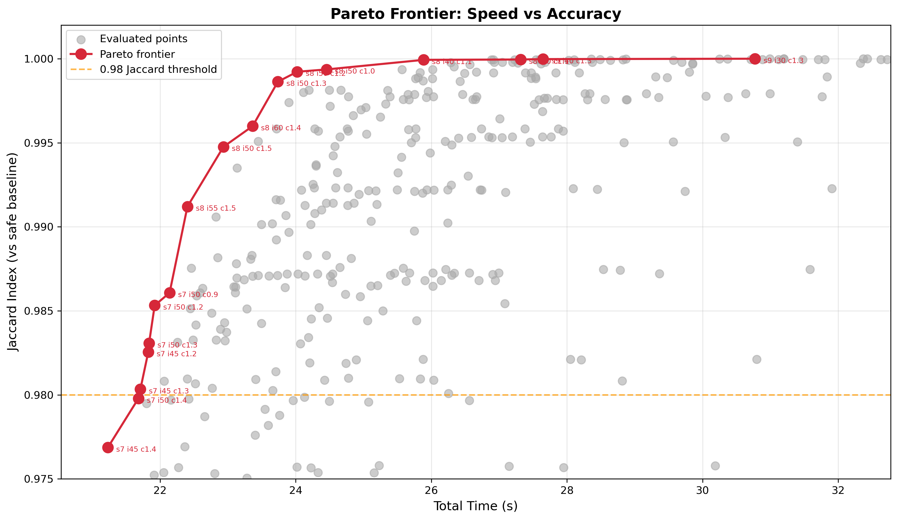
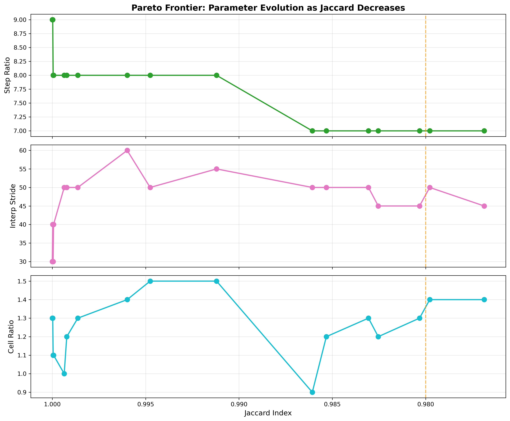
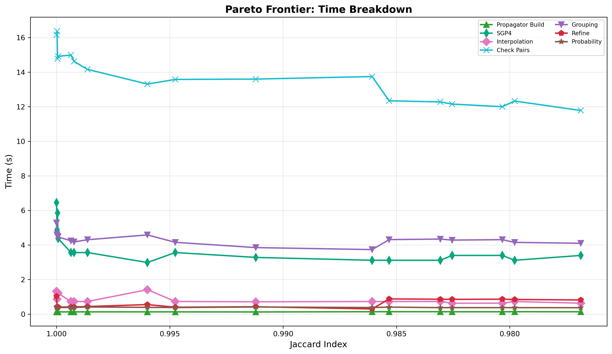
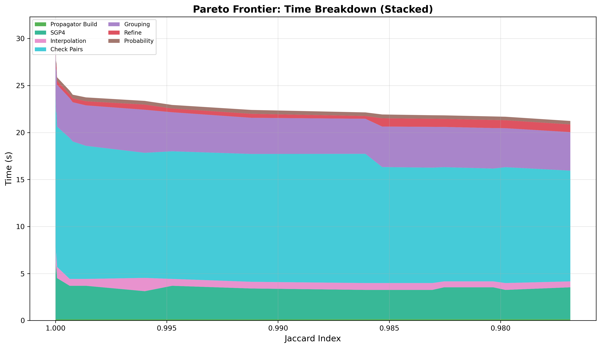
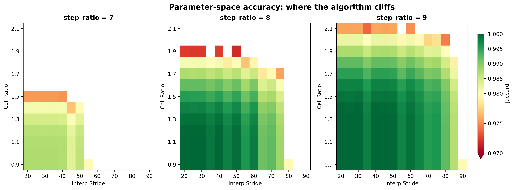

# Pareto Frontier: Speed vs Accuracy

The previous benchmarks (docs 1-4) swept one parameter at a time while holding the others at safe defaults. This
benchmark sweeps all three simultaneously using a bounded grid search to find the Pareto frontier of speed vs accuracy.
The key finding is that picking the 99.9% accuracy option for each parameter individually does NOT produce 99.9%
accuracy when all three are changed together. The losses interact and compound in unexpected ways.

## Setup

- 30100-object catalog, 24 h lookahead, 72 km tolerance, 5 km collision threshold
- 3 iterations per config, median time
- Safe baseline: stepRatio=9, stride=20, cellRatio=0.9 (finest grid in the sweep)
- Knobs grown looser until Jaccard drops below 0.98, then pruned. 348 configs, 310 above the cutoff.

## Accuracy metric

Each candidate's refined events are matched against the safe baseline by NORAD ID pair and TCA within 60 s.
**Jaccard** = `matched / (matched + ours_only + safe_only)`, with two derived rates: **coverage** =
`matched / safe_total` (events recovered) and **fabrication** = `ours_only / safe_total` (events we made up).

## Pareto Frontier

| Step  | Stride | Cell     | Cell (km) | Conj      | Matched   | Ours-only | Safe-only | Jaccard    | Coverage   | Fabrication | Time       |
|-------|--------|----------|-----------|-----------|-----------|-----------|-----------|------------|------------|-------------|------------|
| 9     | 30     | 1.30     | 55.4      | 43871     | 43871     | 0         | 0         | 1.0000     | 1.0000     | 0.0000      | 30.77s     |
| 9     | 40     | 1.30     | 55.4      | 43870     | 43870     | 0         | 1         | 1.0000     | 1.0000     | 0.0000      | 27.65s     |
| 8     | 30     | 1.10     | 65.5      | 43871     | 43870     | 1         | 1         | 1.0000     | 1.0000     | 0.0000      | 27.32s     |
| 8     | 40     | 1.10     | 65.5      | 43868     | 43868     | 0         | 3         | 0.9999     | 0.9999     | 0.0000      | 25.89s     |
| 8     | 50     | 1.00     | 72.0      | 43847     | 43845     | 2         | 26        | 0.9994     | 0.9994     | 0.0000      | 24.45s     |
| 8     | 50     | 1.20     | 60.0      | 43841     | 43839     | 2         | 32        | 0.9992     | 0.9993     | 0.0000      | 24.02s     |
| **8** | **50** | **1.30** | **55.4**  | **43815** | **43813** | **2**     | **58**    | **0.9986** | **0.9987** | **0.0000**  | **23.74s** |
| 8     | 60     | 1.40     | 51.4      | 43697     | 43696     | 1         | 175       | 0.9960     | 0.9960     | 0.0000      | 23.36s     |
| 8     | 50     | 1.50     | 48.0      | 43645     | 43643     | 2         | 228       | 0.9948     | 0.9948     | 0.0000      | 22.93s     |
| 8     | 55     | 1.50     | 48.0      | 43489     | 43487     | 2         | 384       | 0.9912     | 0.9912     | 0.0000      | 22.40s     |
| 7     | 50     | 0.90     | 80.0      | 43262     | 43261     | 1         | 610       | 0.9861     | 0.9861     | 0.0000      | 22.14s     |
| 7     | 50     | 1.20     | 60.0      | 43229     | 43228     | 1         | 643       | 0.9853     | 0.9853     | 0.0000      | 21.92s     |
| 7     | 50     | 1.30     | 55.4      | 43130     | 43129     | 1         | 742       | 0.9831     | 0.9831     | 0.0000      | 21.84s     |
| 7     | 45     | 1.20     | 60.0      | 43107     | 43106     | 1         | 765       | 0.9825     | 0.9826     | 0.0000      | 21.82s     |
| 7     | 45     | 1.30     | 55.4      | 43010     | 43009     | 1         | 862       | 0.9803     | 0.9804     | 0.0000      | 21.71s     |

Bold row is the production operating point: 23.74 s @ Jaccard=0.9986, 1.3x faster than the safe baseline.

## Fabrication stays at zero

Across the entire frontier, `ours_only` never exceeds 2 events out of ~43k. Stage 4 refinement's final SGP4 + 5 km
filter drops anything that doesn't actually pass close, so loosening the knobs only ever drops real events -- it never
invents them. Failure mode is silent under-reporting, not false alarms.

