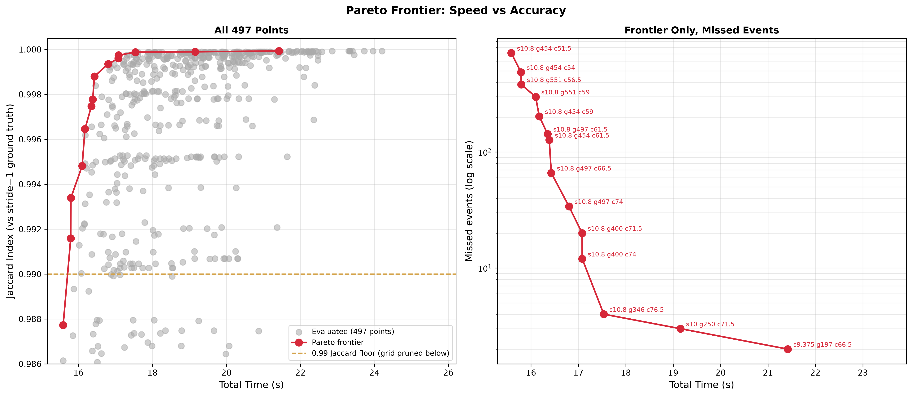
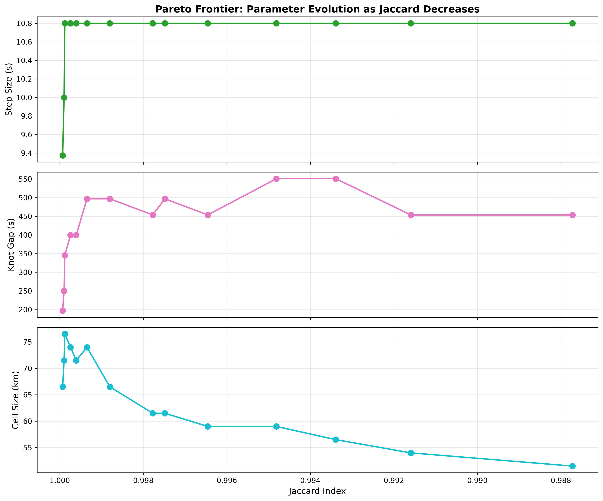
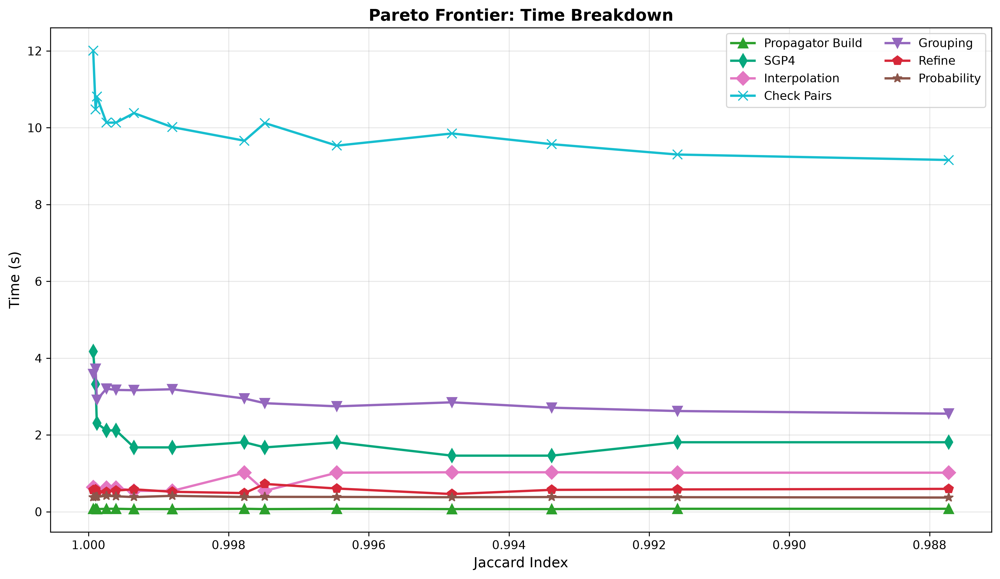
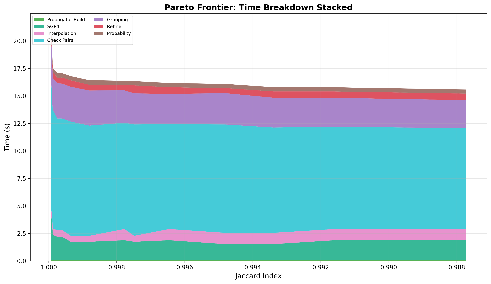

# Pareto Frontier: Speed vs Accuracy

Docs 1-4 sweep one parameter at a time with the others held at safe values. That answers where each parameter stops
paying off on its own, but not whether the isolated optimal values still hold when all applied together. This benchmark
sweeps all three simultaneously using a bounded grid search to find the Pareto frontier of speed vs accuracy.

## Setup

- 31,665-object catalog, 24 h lookahead, 84 km tolerance, 5 km collision threshold
- Ground truth: `stride=1` at step 9.375 s, cell 105 km. Deliberately safe defaults.
- 3 iterations per config, median time; the full 497-point search ran 6 h 12 min
- Steps 9.375 / 10.0 / 10.8 / 12.0 s, knot gap 150 to 700 s in 50 s steps, cell size 84 down to 44 km in 2.5 km steps
- **Jaccard** = `matched / (matched + ours_only + safe_only)`, matched by NORAD pair and TCA within 60 s

Each axis ends at the first value whose 1-D sweep fell below 0.99 Jaccard: step 12.0 s, gap 684 s, cell 44 km. A
parameter that cannot clear the bar on its own never clears it once another is also loosened, so the bound cannot
exclude a configuration that would have qualified.

## Pareto Frontier

| Step (s) | Knot Gap | Cell (km) | Stride | Conj       | Missed | Extra | Jaccard     | Time      |
|----------|----------|-----------|--------|------------|--------|-------|-------------|-----------|
| 9.375    | 197s     | 66.5      | 21     | 58,406     | 2      | 2     | 0.99993     | 21.4s     |
| 10.0     | 250s     | 71.5      | 25     | 58,406     | 3      | 3     | 0.99990     | 19.2s     |
| **10.8** | **346s** | **76.5**  | **32** | **58,405** | **4**  | **3** | **0.99988** | **17.5s** |
| 10.8     | 400s     | 74.0      | 37     | 58,397     | 12     | 3     | 0.99974     | 17.1s     |
| 10.8     | 400s     | 71.5      | 37     | 58,389     | 20     | 3     | 0.99961     | 17.1s     |
| 10.8     | 497s     | 74.0      | 46     | 58,376     | 34     | 4     | 0.99935     | 16.8s     |
| 10.8     | 497s     | 66.5      | 46     | 58,344     | 66     | 4     | 0.99880     | 16.4s     |
| 10.8     | 454s     | 61.5      | 42     | 58,282     | 127    | 3     | 0.99777     | 16.4s     |
| 10.8     | 497s     | 61.5      | 46     | 58,267     | 143    | 4     | 0.99748     | 16.4s     |
| 10.8     | 454s     | 59.0      | 42     | 58,207     | 203    | 4     | 0.99646     | 16.2s     |
| 10.8     | 551s     | 59.0      | 51     | 58,111     | 299    | 4     | 0.99481     | 16.1s     |
| 10.8     | 551s     | 56.5      | 51     | 58,028     | 382    | 4     | 0.99339     | 15.8s     |
| 10.8     | 454s     | 54.0      | 42     | 57,923     | 487    | 4     | 0.99159     | 15.8s     |
| 10.8     | 454s     | 51.5      | 42     | 57,697     | 713    | 4     | 0.98772     | 15.6s     |

Bold row is the production operating point. It sits where marginal cost breaks.

## Combined effect

Each 1-D sweep has a loosest value that still scored 0.999 or better on its own axis: a 10.8 s step in `docs/1`, a 516 s
gap in `docs/2`, 56 km cells in `docs/3`. Applied together they score 0.99454 and miss 314 events, against 4 at the
operating point. They do not survive combination because each already costs tens to hundreds of events on its own, and
those costs add:

|                    | Missed |
|--------------------|-------:|
| Neither loosened   |      4 |
| Gap only, 497 s    |     34 |
| Cell only, 56.5 km |    287 |
| Added              |    317 |
| Measured together  |    314 |

This holds across the grid. Predicting any configuration's missed count by adding the cost of each loosened parameter
separately is exact for 348 of the 497 points.

Step size and cell size are not two independent settings. `docs/1` derives the closing speed below which a pair is
guaranteed to be sampled while still inside the tolerance sphere:

    v_guar = 2 * sqrt(min(cell_size, tolerance)^2 - threshold^2) / step

Pairs closing faster than `v_guar` can cross the sphere between two samples and go unseen. Cell size and step size both
appear in it, so what decides the guarantee is the value the two produce together. Three configurations at a 200 s knot
gap:

| Cell    | Step   | v_guar    | Missed |
|---------|--------|-----------|-------:|
| 56.5 km | 9.375s | 12.0 km/s |     45 |
| 56.5 km | 10.8s  | 10.4 km/s |    285 |
| 49 km   | 9.375s | 10.4 km/s |    276 |

The first two share a cell size and are 6.3x apart. The last two have neither cell size nor step in common, share
only a `v_guar` (to within 0.2%), and are 3.3% apart. Across the whole grid, pairing configurations at the same knot gap,
two sharing a cell size but not a step typically differ by 1.7x in missed events, and two sharing a `v_guar` (to within
2%) by 10%.

The knot gap does not appear in `v_guar`, and it causes misses a different way. Cell size and step decide whether a
close pair is compared at all. The gap decides how far the interpolated positions have drifted from real SGP4 when that
comparison happens.

The three parameters therefore act through two error sources. Interpolation error follows the knot gap. Grid capture
follows `v_guar`, which step size and cell size set jointly. The equivalence has a limit: above `v_guar` the grid
still raises most pairs out to the tolerance, so the loss there is set by the step and the tolerance, and the cell size
barely enters. The only 12.0 s configuration to survive pruning misses 788 events at a `v_guar` of 14.0 km/s, where
every shorter-step configuration sits in the noise; 784 of them have both samples around their closest approach beyond
the 84 km tolerance.

## Fabrication

`ours_only` stays between 2 and 6 across the whole grid, against roughly 58,000 events. Stage 4 propagates SGP4 at the
analytical TCA and drops anything past 5 km, so every stored event is a real approach that ground truth's pair-plus-60 s
match did not pair. Wherever an instrumented rerun checked, they are near-stationary pairs that both runs report once
but at different minima, more than 60 s apart. The failure mode of loosening the parameters is missed events.

