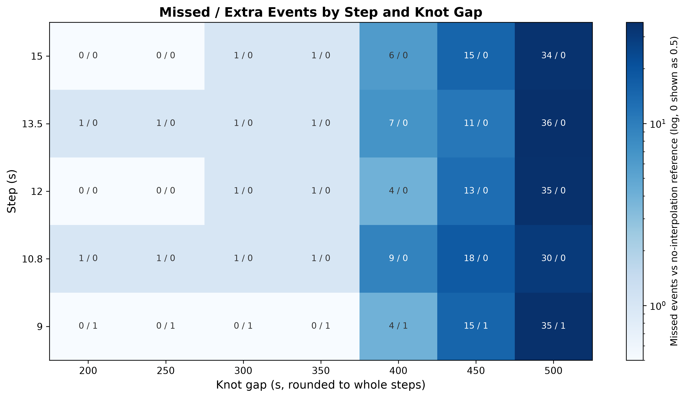
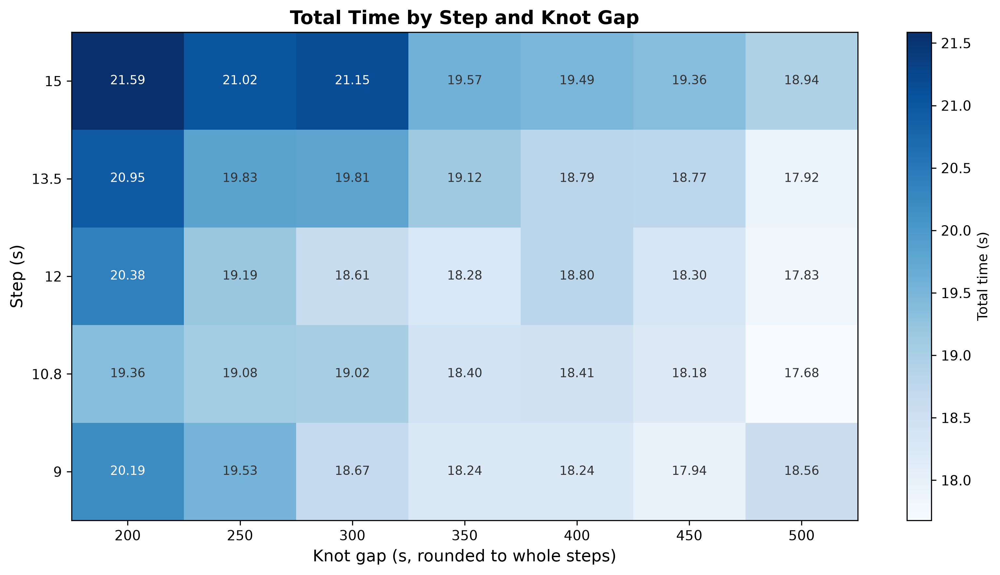

# Step x Knot Gap Sweep

With the tolerance and the cell both following the step (`docs/4`, `docs/3`), two parameters are left to tune: the step
and the knot gap. Docs 1 and 2 sweep each alone with the other at its production value. This grid sweeps both together,
to check whether they interact.

## Setup

- 31,665-object catalog, 24 h lookahead, 5 km collision threshold, tolerance derived from each step, cell as wide as it
- Ground truth: no interpolation (SGP4 at every step) at step 9.375 s, 84 km tolerance, 105 km cell. Each value switches
  one shortcut off: no interpolation, a cell wider than the tolerance so the grid compares every pair inside it, and a
  tolerance the catalog's fastest pair (17.13 km/s) cannot cross between samples. It shares grouping, the gate and
  refinement with every config.
- Steps 9 / 10.8 / 12 / 13.5 / 15 s x knot gap 200 to 500 s in 50 s steps
- 5 iterations per config, median time; the 35-point grid ran 51 min
- **Jaccard** = `matched / (matched + ours_only + safe_only)`, matched by NORAD pair and TCA within 60 s. Pairs in
  formation flight (under 10 m/s, the cutoff collision probability also uses) are matched by pair alone: their separation
  is flat, so where two runs place its minimum is arbitrary, often hours apart.

## Results

Accuracy follows the knot gap alone. Every column reads the same from top to bottom: 0 or 1 missed up to 350 s at every
step, 4 to 9 at 400 s, 11 to 18 at 450 s, 30 to 36 at 500 s. The single events that tell the rows apart are the step
sweep's (`docs/1`). At 10.8 and 13.5 s a pair closing faster than 15.6 km/s falls outside the tolerance at every gap.
At 9 s the 70.4 km tolerance splits a slow pair's two minima into two events at every gap. At 12 and 15 s nothing is
missed below 300 s.

Time follows the gap too, through SGP4: 3.9 to 4.0 s at 200 s down to 1.6 to 1.7 s at 500 s, the same at every step.
At a fixed gap, steps 9 to 13.5 s lie within 0.6 to 1.6 s of each other with no step consistently ahead. 15 s is 1.3 to
2.5 s slower than the fastest of them at every gap. The step is a speed setting with a flat optimum and no effect on
accuracy, and the knot gap is the only parameter that trades one for the other.

## Frontier

| Step (s) | Knot Gap | Conj       | Missed | Extra | Jaccard     | Time       |
|----------|----------|------------|--------|-------|-------------|------------|
| **12**   | **252s** | **58,406** | **0**  | **0** | **1.00000** | **19.19s** |
| 9        | 351s     | 58,407     | 0      | 1     | 0.99998     | 18.24s     |
| 9        | 450s     | 58,392     | 15     | 1     | 0.99973     | 17.94s     |
| 10.8     | 497s     | 58,376     | 30     | 0     | 0.99949     | 17.68s     |

Bold row is the production configuration: the fastest one that reproduces the reference exactly. Three others do too
(12 s / 204 s, 15 s / 255 s, 15 s / 195 s), each at least 1.2 s slower. Below it the frontier is how far the parameters
can be pushed if a mismatch is acceptable. 9 s / 351 s saves 0.95 s and reports one extra event, the slow pair's second
minimum. The fastest point saves 1.5 s for 30 missed.
