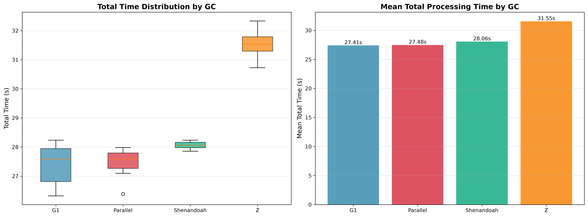
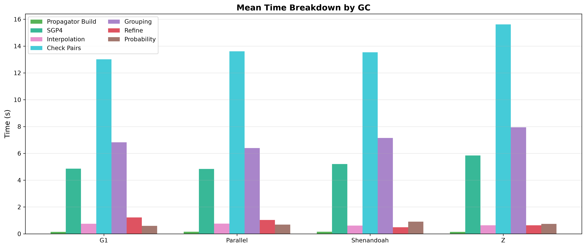

# Garbage Collector Comparison

Each GC runs the same fixed-parameter conjunction pipeline 10 times to measure throughput difference.

## Parameters

- **tolerance-km**: 84
- **step-seconds**: 10.8
- **interpolation-stride**: 32 (346 s knot gap)
- **cell-size-km**: 74
- **lookahead-hours**: 24
- **threshold-km**: 5.0
- **iterations**: 10 per GC
- **heap**: 12 GB (-Xmx12g -Xms12g -XX:+AlwaysPreTouch)
- **catalog**: 31,665 objects (element sets at most 10 days old, median age 8.7 h), one 24 h pass from 2026-08-03T18:00Z

## Results

| GC         | Mean Time | Std Dev | Min    | Max    | Conjunctions |
|------------|-----------|---------|--------|--------|--------------|
| G1         | 29.92s    | 0.79s   | 28.80s | 31.03s | 58,405       |
| Parallel   | 29.61s    | 0.30s   | 29.16s | 30.13s | 58,405       |
| Shenandoah | 29.23s    | 0.23s   | 28.89s | 29.73s | 58,405       |
| Z          | 32.54s    | 0.27s   | 32.26s | 33.14s | 58,405       |

All four detect identical conjunctions. The difference is pure runtime.

G1, Parallel and Shenandoah span 2.3%, too close for ten samples to separate. Shenandoah is fastest on the mean and
holds the tightest spread, 0.23s against G1's 0.79s.

ZGC is 11.3% slower than Shenandoah. The pipeline allocates in large short-lived bursts, one position cache per
subwindow, then drops the whole thing. Generational copying collectors handle that shape well, while ZGC's concurrent
machinery is built to keep pause times down, which is not the constraint here.

**Recommendation: G1**, the default, since nothing beat it decisively enough to justify pinning an alternative.

