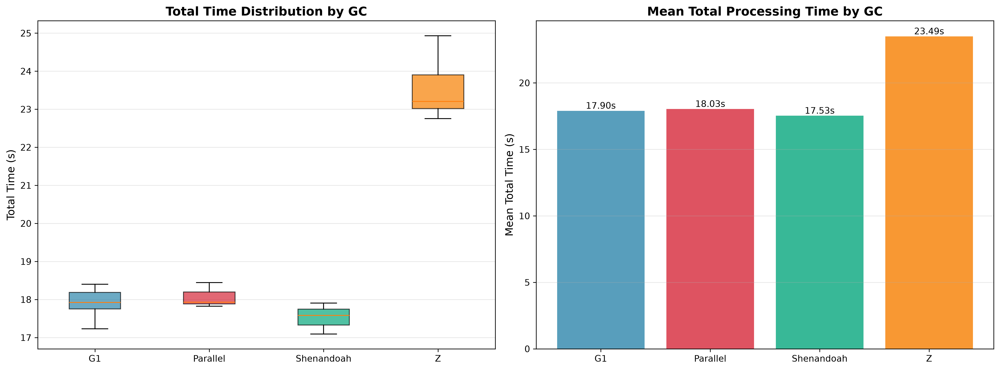
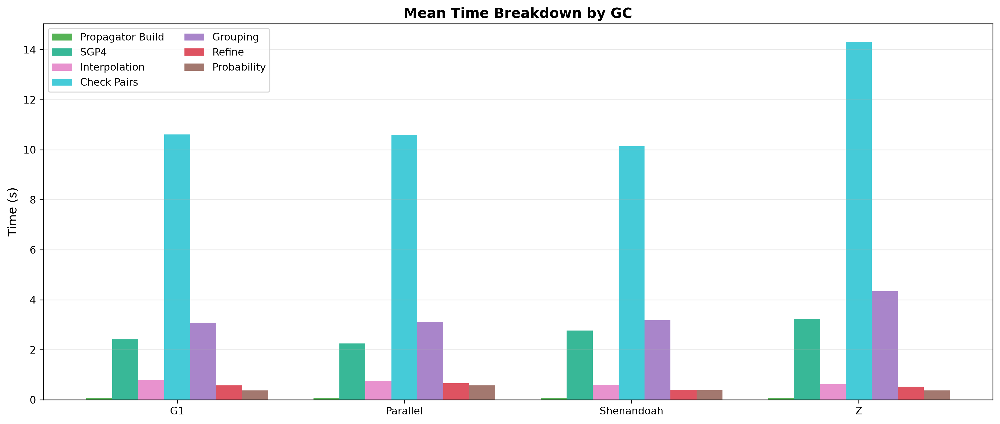

# Garbage Collector Comparison

Each GC runs the same fixed-parameter conjunction pipeline 10 times to measure throughput difference.

## Parameters

- **tolerance-km**: 84
- **step-seconds**: 10.8
- **interpolation-stride**: 32 (346 s knot gap)
- **cell-size-km**: 76.5
- **lookahead-hours**: 24
- **threshold-km**: 5.0
- **subwindowing**: none
- **iterations**: 10 per GC
- **heap**: 12 GB (-Xmx12g -Xms12g -XX:+AlwaysPreTouch)
- **catalog**: 31,665 objects (element sets at most 10 days old, median age 8.7 h), one 24 h pass from 2026-08-03T18:00Z

## Results

| GC         | Mean Time | Std Dev | Min    | Max    | Conjunctions |
|------------|-----------|---------|--------|--------|--------------|
| G1         | 17.90s    | 0.38s   | 17.23s | 18.40s | 58,405       |
| Parallel   | 18.03s    | 0.21s   | 17.82s | 18.44s | 58,405       |
| Shenandoah | 17.53s    | 0.27s   | 17.09s | 17.90s | 58,405       |
| Z          | 23.49s    | 0.69s   | 22.75s | 24.93s | 58,405       |

All four detect identical conjunctions. The difference is pure runtime.

G1, Parallel and Shenandoah are within 2.8% of each other, practically within noise.

ZGC is the outlier, 31.2% slower than G1. Each iteration allocates a 3.0 GB position cache and tens of millions of
short-lived detections, then drops them all, and ZGC is built for pause time rather than throughput. But that's a guess.

**Recommendation: G1**, the default, since nothing beat it decisively enough to justify pinning an alternative.

