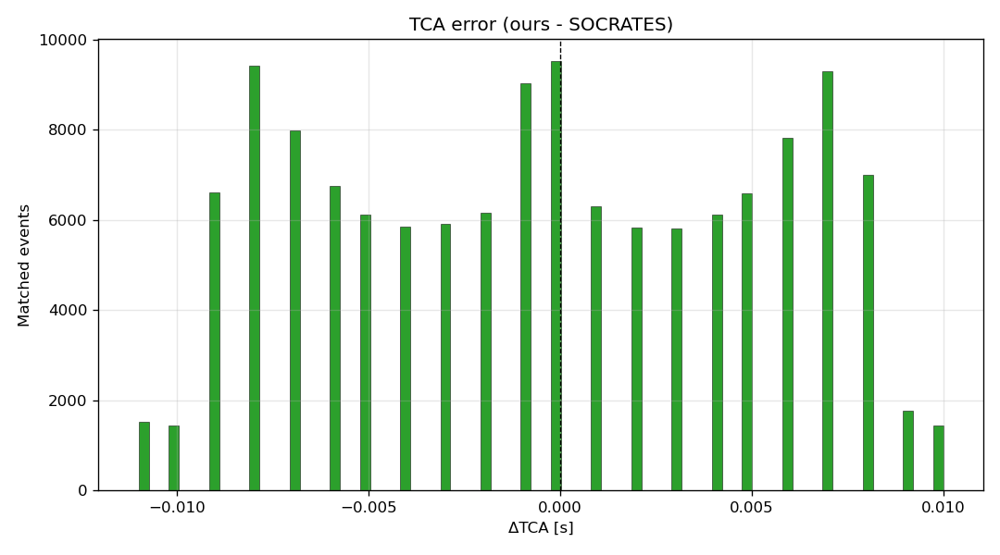
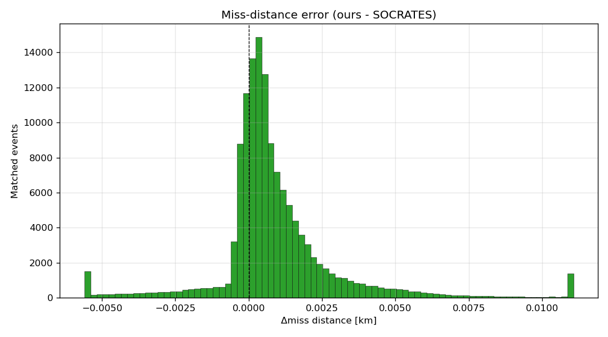
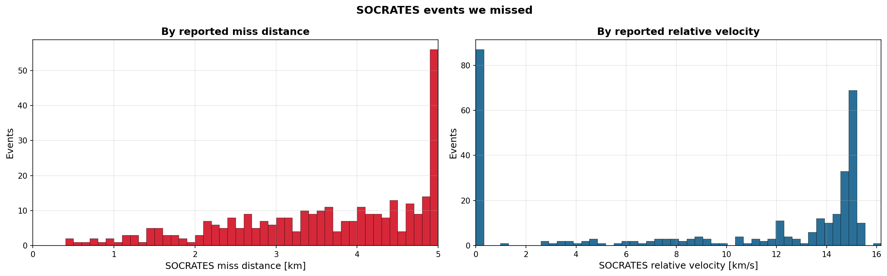

# SOCRATES Comparison

Validate the pipeline against CelesTrak's SOCRATES Plus by running both on the same TLE catalog state over the same
window, then measure agreement at the event level.

## Methodology

### Reference run

SOCRATES Plus catalog generated 2026-05-10 07:02 UTC, computation interval start 2026-05-09 19:00 UTC, 7-day
lookahead, 5 km miss-distance threshold. CelesTrak generates this list twice daily by propagating the active-payload
primary set against the full Space-Track catalog with SGP4/STK-CAT and publishes the result as
`sort-minRange.csv`.

### TLE catalog reconstruction

The dominant source of disagreement between two independent SGP4 implementations is the input. To eliminate that
variable we replicate SOCRATES's TLE set exactly:

1. `socrates.csv` carries `DSE_1` and `DSE_2` (days since each side's TLE epoch) for every conjunction. For each
   NORAD that appears in any row, compute target TLE epoch as `TCA - DSE days`.
2. `socrates-catalog-sync.py` pulls Space-Track `gp_history` in over a 30-day window ending at 2026-05-09 19:00 UTC.
3. For each NORAD, pick the `gp_history` row whose EPOCH is closest to the target within 60 s.
4. Write the result to CSV and load it into the local Postgres `satellite` table via
   `TRUNCATE satellite CASCADE; \copy satellite FROM ...`.

The resulting `satellite` table is per-satellite TLE-identical with SOCRATES for every conjunction-producing
satellite. Any disagreement after this point is caused by the propagator, screening, or filter mismatch.

### Our screening run

`SocratesComparisonBenchmark` runs the pipeline once over the 168 h window starting at 2026-05-09 19:00 UTC, reading
from the reconstructed `satellite` table. The 5 km refinement output is dumped to `ours.csv`.

### Scoping filters

SOCRATES Plus specifies what counts as a reportable conjunction. We apply the same rules to both catalogs before
matching:

- **Primary-vs-all.** SOCRATES screens active payloads against the full catalog. We keep only events where at least
  one NORAD is in CelesTrak's `active.txt` - the closest public proxy for SOCRATES's curated primary list.
- **Intra-fleet exclusion.** SOCRATES drops conjunctions where both satellites are fully operational members of the
  same constellation (Starlink, OneWeb...). We replicate by mapping each NORAD to a constellation label via regex on
  `OBJECT_NAME` (`satellite_names.csv`), then dropping events where both NORADs are in `active.txt` AND share a
  fleet.
- **Formation-flight exclusion.** Drop events with relative velocity below 10 m/s on either side. Formation-flying
  pairs produce hundreds of SOCRATES events per pair while our pipeline clusters all consecutive close-approach
  detections into a single event. That's a design difference, not a physical disagreement, and it inflates the
  apparent recall gap. 10 m/s is the same threshold the pipeline already uses internally to skip collision probability
  computation.

### Event matching

A conjunction is between two satellites. Two events match if they involve the same pair of satellites and their
times of closest approach are within 1 minute of each other.

## Headline

| Events                                   |   Count |                                         |
|------------------------------------------|--------:|----------------------------------------:|
| SOCRATES total                           | 134,548 |                                         |
| Our total                                | 134,680 |                                         |
| Matched (both flagged the same event)    | 134,228 |                                         |
| Ours only (we flagged, SOCRATES did not) |     452 | **99.7%** of ours SOCRATES also flagged |
| SOCRATES only (they flagged, we did not) |     320 |      **99.8%** of SOCRATES we also flag |

## Physics agreement on matched events

For the 134,228 events both pipelines flag:

|               Quantity | Median |    p95 |
|-----------------------:|-------:|-------:|
|               ΔTCA (s) |  0.000 |  0.009 |
|    Δmiss-distance (km) | 0.0005 | 0.0053 |
| Δrelative-speed (km/s) |     ~0 | 0.0005 |

TCA agrees to **9 ms** and miss distance to **5 m** at p95.

## No decay across the prediction window

| Day | SOCRATES |   Ours | Matched | % of ours SOCRATES flagged | % of SOCRATES we flagged |
|----:|---------:|-------:|--------:|---------------------------:|-------------------------:|
|   1 |   19,271 | 19,242 |  19,210 |                      99.8% |                    99.7% |
|   2 |   19,235 | 19,265 |  19,185 |                      99.6% |                    99.7% |
|   3 |   19,068 | 19,105 |  19,034 |                      99.6% |                    99.8% |
|   4 |   19,520 | 19,509 |  19,470 |                      99.8% |                    99.7% |
|   5 |   19,252 | 19,301 |  19,211 |                      99.5% |                    99.8% |
|   6 |   19,000 | 19,065 |  18,968 |                      99.5% |                    99.8% |
|   7 |   19,202 | 19,193 |  19,150 |                      99.8% |                    99.7% |

Agreement is flat at 99.5%+ across all seven days.

## The remaining 0.2%

320 SOCRATES events have no match in our catalog. The histograms plot their SOCRATES-reported miss distance and relative
velocity. The spike against the 5 km wall is the boundary-disagreement bucket: SOCRATES says just under 5 km, our system
says just over, and the event is skipped. The remaining 216 events spread across the 0-5 km range with no clear pattern;
cause unknown. The velocity panel shows a second spike near zero: 87 missed events sit below 340 m/s, a long tail of
slow co-orbiting pairs that survived the 10 m/s formation-flight filter.

## Inputs (regenerable)

- socrates.csv: https://celestrak.org/SOCRATES/sort-minRange.csv
- satellite table: `python3 docs/8-socrates-comparison/socrates-catalog-sync.py` (reconstructs SOCRATES's TLE set
  from socrates.csv's DSE columns, pulls those exact TLEs from Space-Track, loads into Postgres)
- ours.csv: `./mvnw spring-boot:run -Dspring-boot.run.profiles=benchmark-socrates`
- active.txt: https://celestrak.org/NORAD/elements/gp.php?GROUP=active&FORMAT=tle
- satellite_names.csv: `\copy (select norad_cat_id, object_name from satellite) to stdout csv header`
