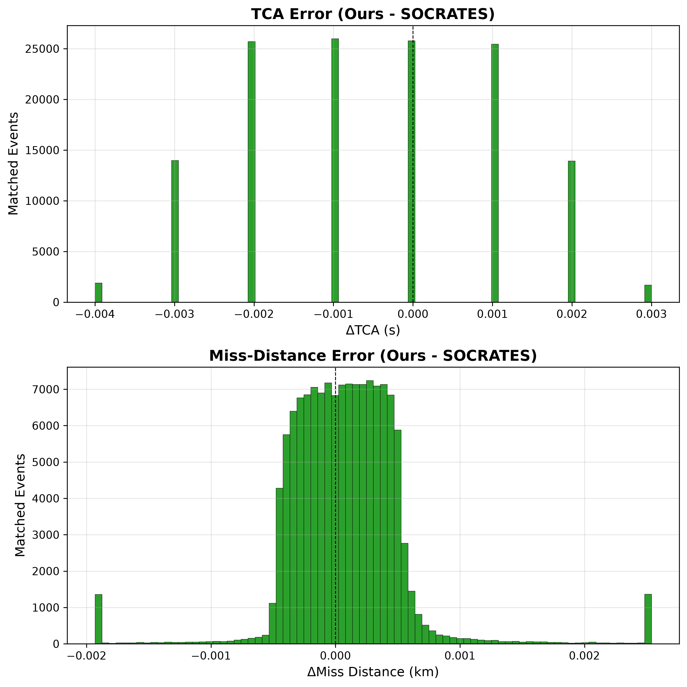
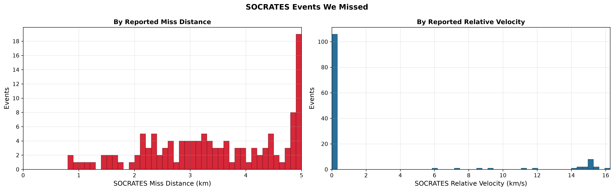

# SOCRATES Comparison

The pipeline was validated against CelesTrak's SOCRATES Plus by running both on the same TLE catalog state over the same
window, then measuring agreement at the event level.

## Methodology

### Reference run

SOCRATES Plus catalog generated 2026-05-10 07:02 UTC, computation interval start 2026-05-09 19:00 UTC, 7-day lookahead,
5 km miss-distance threshold. CelesTrak generates this list by propagating the active-payload primary set
against the full Space-Track catalog with SGP4/STK-CAT and publishes the result as
`sort-minRange.csv`.

### TLE catalog reconstruction

The dominant source of disagreement between two independent SGP4 implementations is the input. To eliminate that
variable we replicate SOCRATES's TLE set exactly:

1. `socrates.csv` carries `DSE_1` and `DSE_2` (days since each side's TLE epoch) for every conjunction. For each NORAD
   that appears in any row, compute target TLE epoch as `TCA - DSE days`.
2. `socrates-catalog-sync.py` pulls Space-Track `gp_history` in over a 30-day window ending at 2026-05-09 19:00 UTC.
3. For each NORAD, take the `gp_history` rows whose EPOCH is within 60 s of the target, and pick the one created last
   before SOCRATES pulled its catalog (`T_SNAPSHOT`, 2026-05-09 18:22:40 UTC).
4. Write the result to CSV and load it into the local Postgres `satellite` table via
   `TRUNCATE satellite CASCADE; \copy satellite FROM ...`.

Step 3 needs the creation date because Space-Track republishes refitted element sets under the same epoch, and DSE only
resolves the epoch to ~86 s. Picking the closest epoch instead gives 3,007 objects the wrong version, which moves 35
SOCRATES approaches by more than 100 km.

### Our screening run

`SocratesComparisonBenchmark` runs the pipeline once over the 168 h window starting at 2026-05-09 19:00 UTC, reading
from the reconstructed `satellite` table. The 5 km refinement output is dumped to `ours.csv`.

### Scoping filters

SOCRATES Plus specifies what counts as a reportable conjunction. We apply the same rules to both catalogs before
matching:

- **Primary-vs-all.** SOCRATES screens active payloads against the full catalog. We keep only events where at least one
  NORAD is in CelesTrak's `active.txt` - the closest public proxy for SOCRATES's curated primary list.
- **Intra-fleet exclusion.** SOCRATES drops conjunctions where both satellites are fully operational members of the same
  constellation. The fleet list (Starlink, OneWeb, Kuiper, Qianfan, Hulianwang, Geesat) was reverse-engineered from the
  comparison itself: skip the intra-fleet filter on both sides, look at same-name-prefix pairs that appear in our output
  but not SOCRATES's, and any prefix with a non-trivial signal goes in the list. We map each NORAD to a constellation
  label via regex on `OBJECT_NAME` (`satellite_names.csv`), then drop events where both NORADs are in `active.txt` AND
  share a fleet.
- **Formation-flight exclusion.** Drop events with relative velocity below 10 m/s on either side. Formation-flying pairs
  produce hundreds of SOCRATES events per pair while our pipeline clusters all consecutive close-approach detections
  into a single event. That's a design difference, not a physical disagreement, and it overstates the number of events
  we miss. 10 m/s is the same threshold the pipeline already uses internally to skip collision probability computation.

### Event matching

A conjunction is between two satellites. Two events match if they involve the same pair of satellites and their times of
closest approach are within 1 minute of each other.

| Events                                   |   Count |                                         |
|------------------------------------------|--------:|----------------------------------------:|
| SOCRATES total                           | 134,598 |                                         |
| Our total                                | 134,756 |                                         |
| Matched (both flagged the same event)    | 134,470 |                                         |
| Ours only (we flagged, SOCRATES did not) |     286 | **99.8%** of ours SOCRATES also flagged |
| SOCRATES only (they flagged, we did not) |     128 |      **99.9%** of SOCRATES we also flag |

## Physics agreement on matched events

For the 134,470 events both pipelines flag:

|               Quantity | Median |    p95 |
|-----------------------:|-------:|-------:|
|               ΔTCA (s) | -0.001 |  0.003 |
|    Δmiss-distance (km) | 0.0001 | 0.0007 |
| Δrelative-speed (km/s) |     ~0 | 0.0005 |

TCA agrees to **3 ms** and miss distance to **0.7 m** at p95.

## Agreement across the prediction window

| Day | SOCRATES |   Ours | Matched | % of ours SOCRATES flagged | % of SOCRATES we flagged |
|----:|---------:|-------:|--------:|---------------------------:|-------------------------:|
|   1 |   19,283 | 19,256 |  19,233 |                      99.9% |                    99.7% |
|   2 |   19,242 | 19,278 |  19,213 |                      99.7% |                    99.8% |
|   3 |   19,079 | 19,119 |  19,074 |                      99.8% |                   100.0% |
|   4 |   19,527 | 19,519 |  19,510 |                     100.0% |                    99.9% |
|   5 |   19,258 | 19,301 |  19,243 |                      99.7% |                    99.9% |
|   6 |   19,005 | 19,066 |  19,002 |                      99.7% |                   100.0% |
|   7 |   19,204 | 19,217 |  19,195 |                      99.9% |                   100.0% |

Agreement is flat at 99.7%+ across all seven days.

## The remaining 0.1

**128 SOCRATES only.** 33 sit within 0.5 km of the 5 km wall (SOCRATES just under, us just over). 106 close below
325 m/s: slow co-orbiting pairs that survived the 10 m/s filter, individuated differently by the two systems. The
groups overlap by 20. The other 9 close at 14.5-16.3 km/s, above the 13.7 km/s capture guarantee: real grid misses.

**286 ours only.** 60 sit within 0.5 km of the wall and 1 is slow. SOCRATES does not report the pairs of the other 225,
though both objects appear elsewhere in its output. Vallado's reference SGP4 puts all 225 under 5 km. 25% have orbital
planes 175° or more apart (1.1% of matched events), and they thin out to ~0 at the start, middle and end of the window.
George & Harvey (AMOS 2011) found both signatures in the misses of STK Advanced CAT's orbit path pre-filter. SOCRATES
runs on STK CAT, but does not publish which pre-filters it enables.

## Inputs (regenerable)

`socrates.csv` and `active.txt` are snapshots and cannot be regenerated with the exact same data used here. Their URLs
serve the current lists, not the ones this comparison ran on.

- socrates.csv: https://celestrak.org/SOCRATES/sort-minRange.csv as published 2026-05-10 07:02 UTC
- satellite table: `python3 docs/8-socrates-comparison/socrates-catalog-sync.py` (reconstructs SOCRATES's TLE set from
  socrates.csv's DSE columns, pulls those exact TLEs from Space-Track, loads into Postgres)
- ours.csv:
  `./mvnw spring-boot:run -Dspring-boot.run.profiles=benchmark-socrates -Dspring-boot.run.jvmArguments="-Xmx16g -Xms16g -XX:+AlwaysPreTouch -Dconjunction.schedule.cron=-"`
- active.txt: https://celestrak.org/NORAD/elements/gp.php?GROUP=active&FORMAT=tle as pulled 2026-05-10
- satellite_names.csv: `\copy (select norad_cat_id, object_name from satellite) to stdout csv header`
